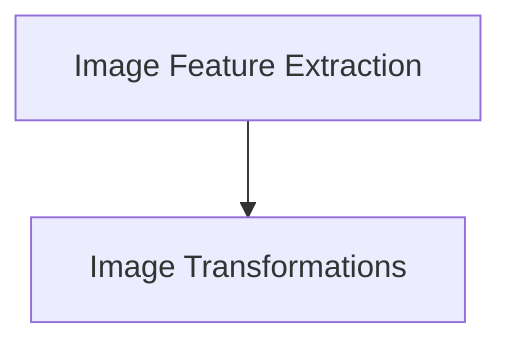

# Image Utilities Module

The `image_utilities` module provides essential functionalities for image manipulation and feature extraction within the system. It encompasses tools for basic image transformations and a comprehensive mixin for various image processing operations, ensuring consistent and efficient handling of image data across different models and pipelines.

## Architecture Overview

The `image_utilities` module is logically divided into two primary sub-modules:

1.  **Image Transformations** (`image_transforms.md`): Handles fundamental image format conversions.
2.  **Image Feature Extraction** (`image_feature_extraction.md`): Offers a rich set of utilities for advanced image feature preparation and processing.

These sub-modules work in conjunction to provide a robust framework for image data management.

<!-- DIAGRAM_JSON
{
    "direction": "TD",
    "nodes": [
        {"id": "image_transforms", "label": "Image Transformations", "type": "module", "link": "image_transforms.md"},
        {"id": "image_feature_extraction", "label": "Image Feature Extraction", "type": "module", "link": "image_feature_extraction.md"}
    ],
    "edges": [
        {"source": "image_feature_extraction", "target": "image_transforms"}
    ],
    "groups": []
}
-->

## Sub-modules

### Image Transformations

This sub-module, documented in [`image_transforms.md`](image_transforms.md), focuses on core image format conversions, such as ensuring images are in RGB format for consistent processing.

### Image Feature Extraction

Detailed in [`image_feature_extraction.md`](image_feature_extraction.md), this sub-module provides a mixin with a wide array of utilities for preparing image features, including scaling, resizing, cropping, and normalization, essential for various computer vision tasks.