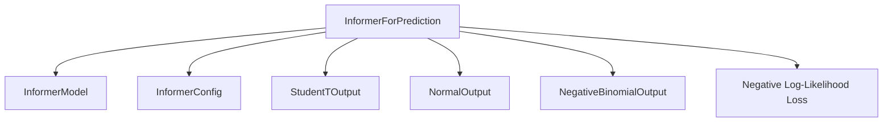

# Informer Models

## Introduction

The `informer_models` module provides the implementation for the Informer model, a powerful architecture designed for long sequence time-series forecasting. The core component, `InformerForPrediction`, enables probabilistic forecasting by leveraging various distribution outputs and a robust encoder-decoder structure.

## InformerForPrediction

`InformerForPrediction` is the primary class within this module, specializing in time series prediction. It extends `InformerPreTrainedModel` and encapsulates the full Informer architecture along with a probabilistic forecasting head. This model can be used for both training (learning to predict future values based on past context) and inference (generating future predictions autoregressively).

### Core Functionality and Features

-   **Probabilistic Forecasting**: The model supports different probability distributions for its output, including Student's T-distribution, Normal distribution, and Negative Binomial distribution. This allows for quantifying the uncertainty in predictions.
-   **Flexible Input Handling**: It can handle various input features crucial for time series forecasting, such as:
    -   `past_values`: The historical time series data used as context.
    -   `past_time_features` and `future_time_features`: Positional encodings or dynamic covariates like "month of year" or "day of the month".
    -   `static_categorical_features` and `static_real_features`: Time-invariant features like a time series ID or promotion information.
    -   `past_observed_mask` and `future_observed_mask`: Masks to handle missing values in the input and target sequences.
-   **Training (`forward` method)**: During training, the model processes both past context and future target values. It computes the parameters of the chosen output distribution and calculates the negative log-likelihood (NLL) loss to optimize its predictions.
-   **Inference (`generate` method)**: For inference, the model operates in an autoregressive manner. Given past context and future time features, it iteratively predicts future time steps by sampling from its output distribution. This allows for generating sequences of probabilistic forecasts.
-   **Underlying Architecture**: The model internally utilizes an `InformerModel` (an encoder-decoder Transformer) to process the time series data and extract relevant features before feeding them into the distribution head.

### How it Fits into the Overall System

The `informer_models` module, specifically `InformerForPrediction`, integrates into a larger system as a specialized time series forecasting model. It can be used as a standalone prediction service or as a component within more complex applications requiring probabilistic forecasts. Its modular design allows it to be configured with different distribution outputs and integrated with standard training and inference pipelines.

### Relationships to Other Components

-   **`InformerModel` (Internal)**: This is the core encoder-decoder Transformer architecture that `InformerForPrediction` wraps. It processes the input sequences to produce hidden states.
-   **`InformerConfig` (External Configuration)**: The configuration object that defines the model's hyperparameters, such as `input_size`, `context_length`, `prediction_length`, `d_model`, `distribution_output`, and `loss`.
-   **Distribution Outputs (`StudentTOutput`, `NormalOutput`, `NegativeBinomialOutput`) (Internal)**: These classes define how the model's output is transformed into parameters for a specific probability distribution. They are dynamically chosen based on `InformerConfig`.
-   **Loss Function (`nll`) (Internal)**: The negative log-likelihood loss function used during training to optimize the model's parameters based on the chosen output distribution.

<!-- DIAGRAM_JSON
{
    "direction": "TD",
    "nodes": [
        {"id": "informer_prediction", "label": "InformerForPrediction", "type": "component", "link": null},
        {"id": "informer_model", "label": "InformerModel", "type": "component", "link": null},
        {"id": "informer_config", "label": "InformerConfig", "type": "external", "link": "informer_config.md"},
        {"id": "student_t_output", "label": "StudentTOutput", "type": "component", "link": null},
        {"id": "normal_output", "label": "NormalOutput", "type": "component", "link": null},
        {"id": "negative_binomial_output", "label": "NegativeBinomialOutput", "type": "component", "link": null},
        {"id": "nll_loss", "label": "Negative Log-Likelihood Loss", "type": "component", "link": null}
    ],
    "edges": [
        {"source": "informer_prediction", "target": "informer_model"},
        {"source": "informer_prediction", "target": "informer_config"},
        {"source": "informer_prediction", "target": "student_t_output"},
        {"source": "informer_prediction", "target": "normal_output"},
        {"source": "informer_prediction", "target": "negative_binomial_output"},
        {"source": "informer_prediction", "target": "nll_loss"}
    ],
    "groups": []
}
-->

