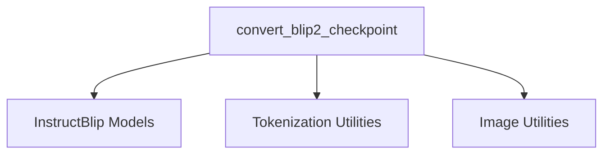

# InstructBlip Conversion Utilities Module

The `instructblip_conversion_utilities` module provides specific utility functions designed to facilitate the conversion of original InstructBlip model checkpoints to a format compatible with the Hugging Face Transformers library. This documentation focuses on the `convert_blip2_checkpoint` function, which is crucial for integrating original InstructBlip models into the Transformers ecosystem.

## Core Functionality: `convert_blip2_checkpoint`

The `convert_blip2_checkpoint` function is responsible for meticulously porting the weights and configurations of original InstructBlip models into the Hugging Face Transformers `InstructBlipForConditionalGeneration` architecture. This process involves a series of transformations to ensure seamless compatibility and accurate reproduction of the original model's behavior.

### Purpose
The primary purpose of `convert_blip2_checkpoint` is to enable researchers and developers to leverage pre-trained InstructBlip models within the Hugging Face framework, benefiting from its extensive tooling, ease of use, and integration capabilities. It handles the intricacies of adapting model architectures, renaming parameters, and verifying output consistency.

### How it Works
The conversion process orchestrated by `convert_blip2_checkpoint` involves the following key steps:

1.  **Tokenizer Initialization**: It initializes appropriate tokenizers (`T5TokenizerFast` or `LlamaTokenizerFast`) for the language model part and a `AutoTokenizer` for the Q-Former, ensuring that text inputs are processed correctly according to the original model's specifications. Special tokens are also added as needed.
2.  **Configuration Loading**: The function loads the InstructBlip model configuration and determines the image size based on the provided model name.
3.  **Hugging Face Model Instantiation**: An `InstructBlipForConditionalGeneration` model is instantiated using the loaded configuration.
4.  **Original Model Loading**: The original InstructBlip model is loaded using the `lavis` library's `load_model_and_preprocess` function. This step retrieves the pre-trained weights from the original implementation.
5.  **State Dictionary Transformation**: The core of the conversion lies in transforming the state dictionary keys from the original model to match the naming conventions of the Hugging Face model. This involves:
    *   Renaming various prefixes (e.g., `Qformer.bert` to `qformer`).
    *   Adjusting attention-related keys (e.g., `attention.self` to `attention`).
    *   Mapping `llm_proj` or `t5_proj` to `language_projection`.
    *   Adapting language model prefixes (e.g., `llm_model` or `t5` to `language`).
    *   Reading in Q-V biases where applicable.
6.  **Weight Loading**: The transformed state dictionary is then loaded into the Hugging Face `InstructBlipForConditionalGeneration` model.
7.  **Processor Creation**: A `BlipImageProcessor` is created with the correct image size, mean, and standard deviation. This, along with the language and Q-Former tokenizers, is used to create an `InstructBlipProcessor`, which encapsulates all preprocessing logic.
8.  **Output Verification**: The function performs a critical verification step by comparing the logits produced by the original model and the converted Hugging Face model for a sample input. This ensures that the conversion has accurately preserved the model's predictive capabilities.
9.  **Generation Test**: A generation test is conducted, comparing the text generated by both the original and converted models to further validate the conversion's fidelity.
10. **Saving and Pushing (Optional)**: If `pytorch_dump_folder_path` or `push_to_hub` arguments are provided, the converted processor and model can be saved locally or pushed to the Hugging Face Model Hub, respectively.

### Usage Example
```python
from transformers import InstructBlipForConditionalGeneration, InstructBlipProcessor
import torch

# Assuming convert_blip2_checkpoint has been run and saved the model
# processor = InstructBlipProcessor.from_pretrained("path/to/your/converted/model")
# model = InstructBlipForConditionalGeneration.from_pretrained("path/to/your/converted/model")

# Example of how the converted model and processor would be used
# images = [...] # Your image data
# prompt = "What is unusual about this image?"
# inputs = processor(images=images, text=prompt, return_tensors="pt")
# outputs = model.generate(**inputs, max_length=256)
# generated_text = processor.batch_decode(outputs, skip_special_tokens=True)
# print(generated_text)
```

## Architecture and Component Relationships

The `instructblip_conversion_utilities` module, particularly the `convert_blip2_checkpoint` function, interacts with several key components to achieve its objective.

<!-- DIAGRAM_JSON
{
    "direction": "TD",
    "nodes": [
        {"id": "convert_blip2_checkpoint", "label": "convert_blip2_checkpoint", "type": "component", "link": null},
        {"id": "instructblip_models", "label": "InstructBlip Models", "type": "external", "link": "instructblip_models.md"},
        {"id": "tokenization_utilities", "label": "Tokenization Utilities", "type": "external", "link": "tokenization_utilities.md"},
        {"id": "image_utilities", "label": "Image Utilities", "type": "external", "link": "image_utilities.md"}
    ],
    "edges": [
        {"source": "convert_blip2_checkpoint", "target": "instructblip_models"},
        {"source": "convert_blip2_checkpoint", "target": "tokenization_utilities"},
        {"source": "convert_blip2_checkpoint", "target": "image_utilities"}
    ],
    "groups": []
}
-->


### Component Relationships:

*   **`convert_blip2_checkpoint`**: This is the central function within this module, orchestrating the entire conversion process.
*   **[InstructBlip Models](instructblip_models.md)**: This external module provides the target architecture for the converted models, specifically `InstructBlipForConditionalGeneration` and `InstructBlipProcessor`. The `convert_blip2_checkpoint` function heavily relies on these components to construct and populate the Hugging Face version of the model.
*   **[Tokenization Utilities](tokenization_utilities.md)**: This external module offers general-purpose tokenizers like `AutoTokenizer`, `T5TokenizerFast`, and `LlamaTokenizerFast`, which are essential for processing text inputs for the language model and Q-Former during conversion and subsequent inference.
*   **[Image Utilities](image_utilities.md)**: This external module provides image processing functionalities, notably `BlipImageProcessor`, which is used to preprocess image inputs according to the InstructBlip model's requirements.

## How the Module Fits into the Overall System

The `instructblip_conversion_utilities` module, particularly through its `convert_blip2_checkpoint` function, plays a vital role in integrating external, pre-trained InstructBlip models into the broader Hugging Face Transformers ecosystem. It acts as a bridge, allowing users to leverage the powerful capabilities of InstructBlip models while benefiting from the standardized interface, comprehensive documentation, and community support offered by Hugging Face.

By providing a robust and verified conversion mechanism, this module ensures that models trained in different frameworks can be seamlessly adopted and utilized within the Transformers library, promoting interoperability and accelerating research and development in multimodal AI.
