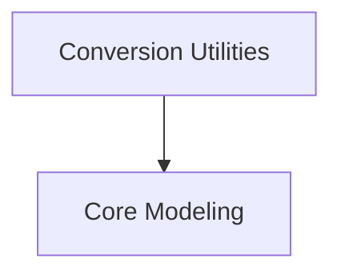

# InstructBLIP Models Documentation

## Introduction
The `instructblip_models` module provides the core components for the InstructBLIP model, which is designed for instruction-following visual language tasks. It includes utilities for converting original InstructBLIP checkpoints to the Hugging Face Transformers format and the main model architecture for performing conditional generation based on visual and textual inputs.

## Architecture
The InstructBLIP model architecture integrates a vision encoder, a Q-Former, and a language model to process multimodal inputs and generate text.

<!-- DIAGRAM_JSON
{
    "direction": "TD",
    "nodes": [
        {"id": "conversion_utilities", "label": "Conversion Utilities", "type": "module", "link": "conversion_utilities.md"},
        {"id": "modeling", "label": "Core Modeling", "type": "module", "link": "modeling.md"}
    ],
    "edges": [
        {"source": "conversion_utilities", "target": "modeling"}
    ],
    "groups": []
}
-->

## Sub-modules Overview

### [Conversion Utilities](conversion_utilities.md)
This sub-module is responsible for converting original InstructBLIP model checkpoints into the Hugging Face Transformers compatible format. It ensures that pre-trained models from other frameworks can be easily loaded and utilized within the Hugging Face ecosystem.

### [Core Modeling](modeling.md)
This sub-module defines the fundamental architecture of the InstructBLIP model. It encompasses the integration of the vision encoder for processing images, the Q-Former for multimodal feature fusion, and the language model for generating conditional text.
