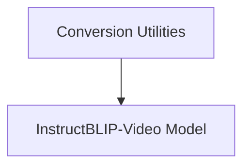

# InstructBLIP-Video Models

The `instructblipvideo_models` module provides the core components for the InstructBLIP-Video model, enabling conditional generation tasks involving both video and text inputs. It includes utilities for converting original model checkpoints and defines the model's architecture.

## Architecture Overview

The InstructBLIP-Video model architecture integrates a vision encoder, a Q-Former, and a language model to process multimodal inputs. The vision encoder extracts features from video frames, which are then used by the Q-Former for cross-attention with learned query tokens and text prompts. The Q-Former's outputs are then projected and fed into the language model for conditional generation.

<!-- DIAGRAM_JSON
{
    "direction": "TD",
    "nodes": [
        {"id": "conversion_utilities", "label": "Conversion Utilities", "type": "module", "link": "conversion_utilities.md"},
        {"id": "modeling_instructblipvideo", "label": "InstructBLIP-Video Model", "type": "module", "link": "modeling_instructblipvideo.md"}
    ],
    "edges": [
        {"source": "conversion_utilities", "target": "modeling_instructblipvideo"}
    ],
    "groups": []
}
-->

## Sub-modules

This module is composed of the following key sub-modules:

*   **[Conversion Utilities](conversion_utilities.md)**: This sub-module handles the conversion of original InstructBLIP-Video model checkpoints to the Hugging Face Transformers format, ensuring compatibility and ease of use within the ecosystem.

*   **[InstructBLIP-Video Model](modeling_instructblipvideo.md)**: This sub-module defines the core InstructBLIP-Video model architecture, integrating vision, Q-Former, and language components to perform conditional generation tasks.
