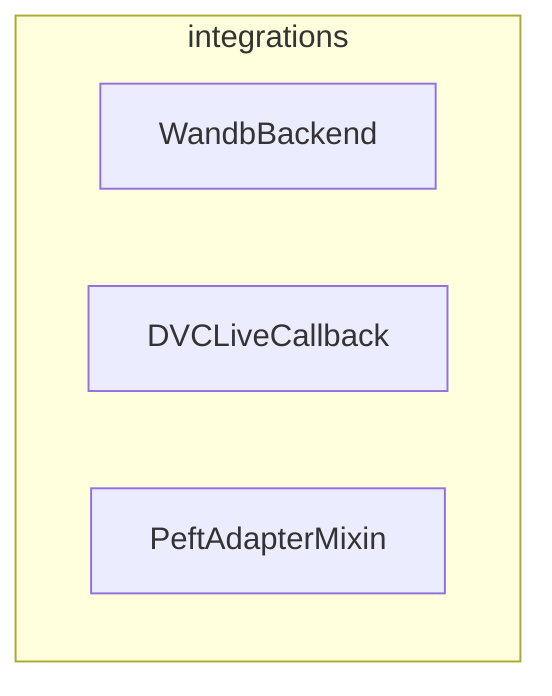

# integrations
This module provides various functionalities to integrate with external tools and libraries, including hyperparameter search backends, training callbacks for logging, and model extensions for parameter-efficient fine-tuning.

<!-- DIAGRAM_JSON
{
    "nodes": [
        {
            "id": "WandbBackend",
            "label": "WandbBackend",
            "url": "src.transformers.hyperparameter_search.WandbBackend"
        },
        {
            "id": "DVCLiveCallback",
            "label": "DVCLiveCallback",
            "url": "src.transformers.integrations.integration_utils.DVCLiveCallback"
        },
        {
            "id": "PeftAdapterMixin",
            "label": "PeftAdapterMixin",
            "url": "src.transformers.integrations.peft.PeftAdapterMixin"
        }
    ],
    "edges": [],
    "groups": [
        {
            "id": "integrations",
            "label": "integrations",
            "nodes": [
                "WandbBackend",
                "DVCLiveCallback",
                "PeftAdapterMixin"
            ]
        }
    ]
}
-->
