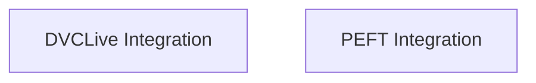

# Integrations Module Documentation

The `integrations` module provides functionalities for integrating the Hugging Face Transformers library with various external tools and libraries. It streamlines the process of using these external tools for tasks such as experiment logging, model fine-tuning with parameter-efficient methods, and more.

## Architecture Overview

The `integrations` module is composed of several sub-modules, each responsible for a specific integration. The current architecture includes integrations for experiment tracking (DVCLive) and parameter-efficient fine-tuning (PEFT).

<!-- DIAGRAM_JSON
{
    "direction": "TD",
    "nodes": [
        {"id": "dvclive_integration", "label": "DVCLive Integration", "type": "module", "link": "dvclive_integration.md"},
        {"id": "peft_integration", "label": "PEFT Integration", "type": "module", "link": "peft_integration.md"}
    ],
    "edges": [],
    "groups": []
}
-->

## Sub-modules

### [DVCLive Integration](dvclive_integration.md)
This sub-module facilitates the integration with DVCLive, a tool for machine learning experiment tracking. It provides a callback for the Hugging Face Trainer to log metrics and manage model checkpoints with DVCLive.

### [PEFT Integration](peft_integration.md)
This sub-module offers utilities for seamless integration with the PEFT (Parameter-Efficient Fine-Tuning) library. It enables loading, managing, and interacting with various PEFT adapters within Hugging Face models.
