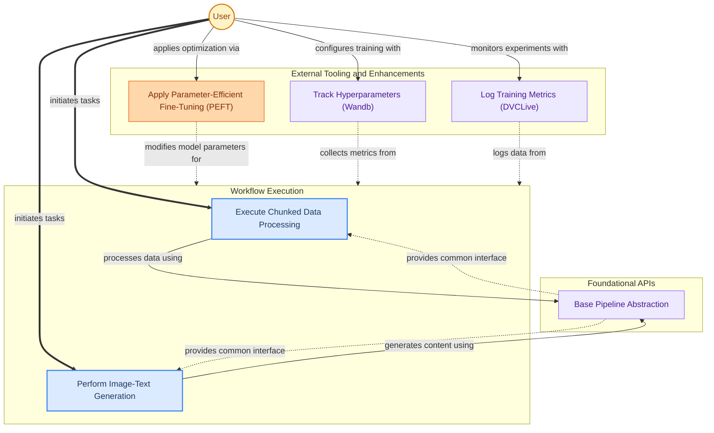

The `integrations_and_workflows` module serves as a crucial bridge, enabling users to seamlessly integrate transformer models with external tools and streamline complex data processing tasks through high-level abstractions. It provides functionalities for enhancing model training and deployment via external services, alongside specialized pipelines for efficient execution of common machine learning workflows.

### How the Module Works

The module is structured into two primary areas: `Integrations` and `Pipelines`. The `Integrations` sub-module focuses on connecting the core transformer library with external platforms for tasks like hyperparameter tuning, experiment logging, and advanced model optimization techniques. The `Pipelines` sub-module offers ready-to-use, high-level APIs that abstract away the complexities of data preprocessing, model inference, and post-processing for specific tasks, such as chunked data handling or multimodal generation. These pipelines are built upon a common base, ensuring consistency and extensibility.

### Core Components Documentation

*   **`src.transformers.hyperparameter_search.WandbBackend`**: Facilitates integration with Weights & Biases for experiment tracking and hyperparameter search.
*   **`src.transformers.integrations.integration_utils.DVCLiveCallback`**: Provides callbacks for logging training metrics and artifacts to DVCLive.
*   **`src.transformers.integrations.peft.PeftAdapterMixin`**: Enables parameter-efficient fine-tuning (PEFT) methods to optimize large models.
*   **`src.transformers.pipelines.base.ChunkPipeline`**: A base pipeline for processing data in chunks, useful for handling large inputs efficiently.
*   **`src.transformers.pipelines.image_text_to_text.ImageTextToTextPipeline`**: A specialized pipeline for generating text outputs from combined image and text inputs.
*   **`src.transformers.pipelines.base.Pipeline`**: The abstract base class from which all specific pipelines inherit, defining the common interface for preprocessing, model inference, and post-processing.