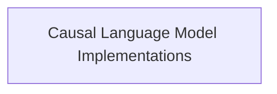

# JetMoe Models Documentation

## Introduction

The `jetmoe_models` module provides implementations for the JetMoe (Mixture-of-Experts) architecture, specifically tailored for causal language modeling. This module integrates a highly efficient sparse attention mechanism with a Mixture-of-Experts routing system, enabling the model to scale effectively while maintaining computational efficiency.

## Architecture Overview

The `jetmoe_models` module is structured around its core causal language model implementations. The primary component is `causal_lm_implementations`, which handles the forward pass, loss computation, and manages the router logits essential for the Mixture-of-Experts functionality.

<!-- DIAGRAM_JSON
{
    "direction": "TD",
    "nodes": [
        {"id": "causal_lm_implementations", "label": "Causal Language Model Implementations", "type": "module", "link": "causal_lm_implementations.md"}
    ],
    "edges": []
}
-->

## Sub-modules

### [Causal Language Model Implementations](causal_lm_implementations.md)

This sub-module contains the core implementations of the JetMoe Causal Language Model. It defines the forward pass logic, calculates the language modeling loss, and incorporates auxiliary loss for load balancing in the Mixture-of-Experts setup.