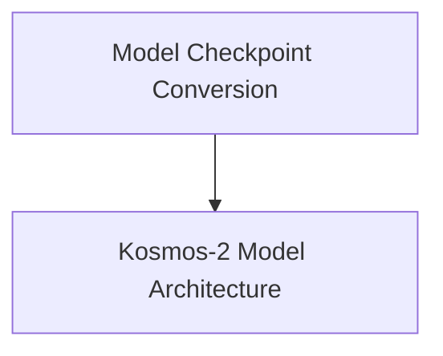

# Kosmos-2 Models Documentation

## Introduction

The `kosmos2_models` module encompasses the core functionalities related to the Kosmos-2 model, a multimodal large language model capable of understanding and generating text grounded in images. This module provides the foundational model architecture and utilities for converting original PyTorch checkpoints to a compatible Hugging Face format.

## Architecture Overview

The Kosmos-2 module is structured into key components that manage its multimodal capabilities and integration within the Hugging Face ecosystem. The architecture separates the core model definition from checkpoint conversion utilities.

<!-- DIAGRAM_JSON
{
    "direction": "TD",
    "nodes": [
        {"id": "model_architecture", "label": "Kosmos-2 Model Architecture", "type": "module", "link": "model_architecture.md"},
        {"id": "model_conversion", "label": "Model Checkpoint Conversion", "type": "module", "link": "model_conversion.md"}
    ],
    "edges": [
        {"source": "model_conversion", "target": "model_architecture"}
    ],
    "groups": []
}
-->

## Sub-modules

### [Kosmos-2 Model Architecture](model_architecture.md)
This sub-module defines the core `Kosmos2Model`, which integrates text and vision components with an image-to-text projection mechanism. It handles the forward pass for multimodal inputs, producing hidden states based on both text and image features.

### [Model Checkpoint Conversion](model_conversion.md)
This sub-module provides utilities for converting original Kosmos-2 PyTorch checkpoints into the Hugging Face format, ensuring compatibility and ease of use within the Hugging Face Transformers library.