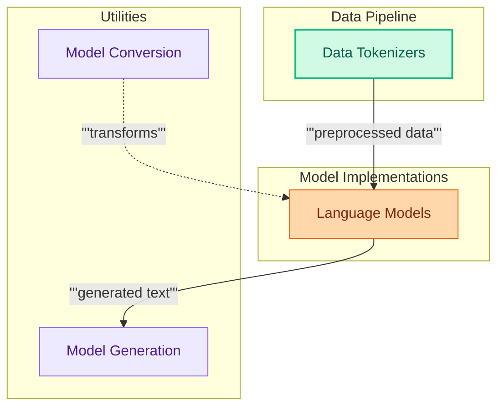

# Language Model Architectures Overview
This module provides an architectural overview of the various language model implementations, data preparation techniques, generation utilities, and model conversion tools within the repository.

<!-- DIAGRAM_JSON
{
    "direction": "TD",
    "nodes": [
        {"id": "lang_models", "label": "Language Models", "type": "module", "link": "language_models.md"},
        {"id": "data_tokenizers", "label": "Data Tokenizers", "type": "module", "link": "tokenizers.md"},
        {"id": "model_gen", "label": "Model Generation", "type": "module", "link": "generation.md"},
        {"id": "model_converters", "label": "Model Conversion", "type": "module", "link": "text_model_converters.md"}
    ],
    "edges": [
        {"source": "data_tokenizers", "target": "lang_models", "label": "preprocessed data"},
        {"source": "lang_models", "target": "model_gen", "label": "generated text"},
        {"source": "model_converters", "target": "lang_models", "label": "transforms"}
    ],
    "groups": [
        {"id": "model_implementations", "label": "Model Implementations", "role": "generative", "nodes": ["lang_models"]},
        {"id": "data_pipeline", "label": "Data Pipeline", "role": "data", "nodes": ["data_tokenizers"]},
        {"id": "utilities", "label": "Utilities", "role": "analytical", "nodes": ["model_gen", "model_converters"]}
    ]
}
-->
