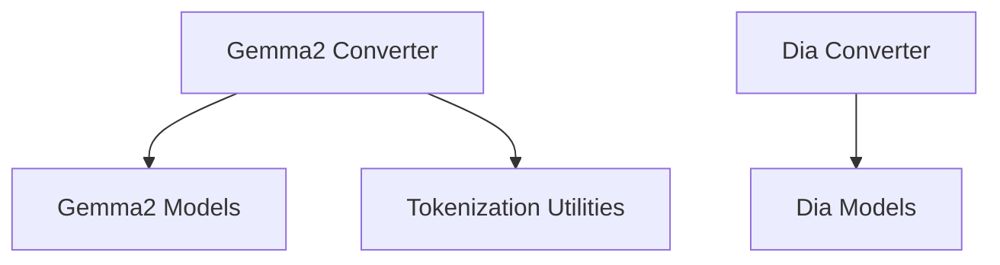

# `language_model_converters`

## Introduction

The `language_model_converters` module is responsible for facilitating the conversion of various language model checkpoints from their original formats to the Hugging Face Transformers library format. This module currently supports converting Gemma2 and Dia models, enabling their seamless integration and usage within the Hugging Face ecosystem.

## Architecture and Component Relationships

This module primarily consists of converter functions, each dedicated to a specific language model architecture. These converters abstract the complexities of weight mapping, configuration translation, and structural adjustments required to align external model formats with the Hugging Face standard.

<!-- DIAGRAM_JSON
{
    "direction": "TD",
    "nodes": [
        {"id": "gemma2_converter", "label": "Gemma2 Converter", "type": "component", "link": null},
        {"id": "dia_converter", "label": "Dia Converter", "type": "component", "link": null},
        {"id": "gemma2_models", "label": "Gemma2 Models", "type": "external", "link": "gemma2_models.md"},
        {"id": "dia_models", "label": "Dia Models", "type": "external", "link": "dia_models.md"},
        {"id": "tokenization_utilities", "label": "Tokenization Utilities", "type": "external", "link": "tokenization_utilities.md"}
    ],
    "edges": [
        {"source": "gemma2_converter", "target": "gemma2_models"},
        {"source": "gemma2_converter", "target": "tokenization_utilities"},
        {"source": "dia_converter", "target": "dia_models"}
    ],
    "groups": []
}
-->

### Core Components

#### `main` (Gemma2 Converter)

Located in `src/transformers/models/gemma2/convert_gemma2_weights_to_hf.py`,
the `main` function serves as the entry point for converting Gemma2 model weights to the Hugging Face format. It handles command-line arguments for specifying input checkpoints, tokenizer paths, model size, output directory, and other conversion options.

**Key Functionality:**

*   Parses command-line arguments for conversion parameters.
*   Optionally converts the tokenizer using utilities from the [tokenization_utilities](tokenization_utilities.md) module.
*   Loads the appropriate Gemma2 model configuration based on the specified `model_size`.
*   Invokes the `write_model` function (not detailed here but assumed to handle the core weight mapping) to save the converted model.
*   Supports pushing the converted model and tokenizer directly to the Hugging Face Hub.

**Dependencies:**

*   [gemma2_models](gemma2_models.md): For Gemma2 model configurations and structures.
*   [tokenization_utilities](tokenization_utilities.md): For tokenizer conversion (e.g., `write_tokenizer`).

#### `convert_dia_model_to_hf` (Dia Converter)

Located in `src/transformers/models/dia/convert_dia_to_hf.py`,
the `convert_dia_model_to_hf` function is responsible for converting Dia models from Nari Labs' format to the Hugging Face format.

**Key Functionality:**

*   Downloads checkpoints from the Hugging Face Hub if needed.
*   Initializes a Hugging Face `DiaForConditionalGeneration` model with a default `DiaConfig`.
*   Iterates through the Nari Labs checkpoint's state dictionary, performing necessary key remapping and tensor reshaping to match the Hugging Face model's structure.
*   Combines multi-channel embeddings.
*   Loads the converted state dictionary into the Hugging Face model.
*   Overwrites the model's generation configuration.

**Dependencies:**

*   [dia_models](dia_models.md): For `DiaForConditionalGeneration` and `DiaConfig`.

## How the Module Fits into the Overall System

The `language_model_converters` module plays a crucial role in expanding the compatibility and interoperability of the Hugging Face Transformers library. By providing dedicated conversion utilities, it enables users to leverage pre-trained models from other frameworks (like Gemma2's native format or Nari Labs' Dia models) within the standardized Hugging Face environment.

This module is part of the broader `general_model_converters` system, which aims to provide a unified approach for integrating various model architectures into the Hugging Face ecosystem. It ensures that new or external language models can be quickly adopted and utilized for downstream tasks, benefiting from the extensive tools and functionalities offered by the Hugging Face platform.
