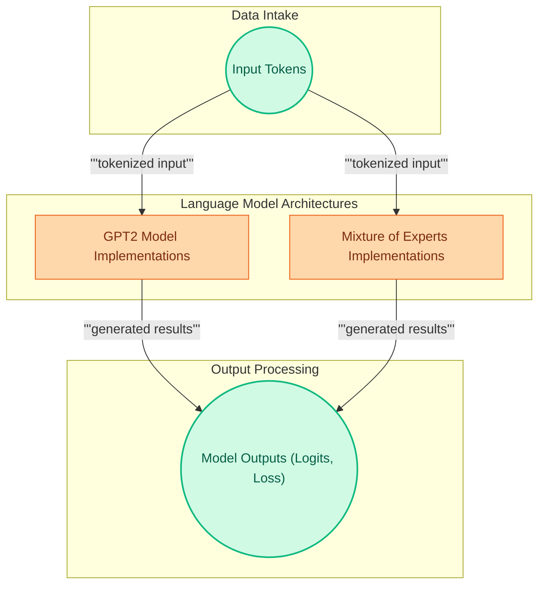

# Language Model Implementations

This module encompasses a diverse collection of language model architectures, including standard GPT-2 models for various NLP tasks and advanced Mixture-of-Experts (MoE) implementations for efficient causal language generation.

<!-- DIAGRAM_JSON
{
    "direction": "TD",
    "nodes": [
        {"id": "input_tokens", "label": "Input Tokens", "type": "external"},
        {"id": "gpt2_implementations", "label": "GPT2 Model Implementations", "type": "module", "link": "gpt2_implementations.md"},
        {"id": "moe_implementations", "label": "Mixture of Experts Implementations", "type": "module", "link": "moe_implementations.md"},
        {"id": "model_outputs", "label": "Model Outputs (Logits, Loss)", "type": "external"}
    ],
    "edges": [
        {"source": "input_tokens", "target": "gpt2_implementations", "label": "tokenized input"},
        {"source": "input_tokens", "target": "moe_implementations", "label": "tokenized input"},
        {"source": "gpt2_implementations", "target": "model_outputs", "label": "generated results"},
        {"source": "moe_implementations", "target": "model_outputs", "label": "generated results"}
    ],
    "groups": [
        {"id": "data_in", "label": "Data Intake", "role": "data", "nodes": ["input_tokens"]},
        {"id": "model_types", "label": "Language Model Architectures", "role": "generative", "nodes": ["gpt2_implementations", "moe_implementations"]},
        {"id": "data_out", "label": "Output Processing", "role": "data", "nodes": ["model_outputs"]}
    ]
}
-->
