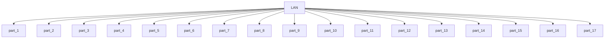

# Language Models

This module contains 17 sub-modules:

- [part_1](part_1.md) - 7 components
- [part_2](part_2.md) - 4 components
- [part_3](part_3.md) - 10 components
- [part_4](part_4.md) - 8 components
- [part_5](part_5.md) - 4 components
- [part_6](part_6.md) - 6 components
- [part_7](part_7.md) - 8 components
- [part_8](part_8.md) - 5 components
- [part_9](part_9.md) - 4 components
- [part_10](part_10.md) - 9 components
- [part_11](part_11.md) - 6 components
- [part_12](part_12.md) - 3 components
- [part_13](part_13.md) - 6 components
- [part_14](part_14.md) - 7 components
- [part_15](part_15.md) - 6 components
- [part_16](part_16.md) - 5 components
- [part_17](part_17.md) - 7 components

## Architecture

