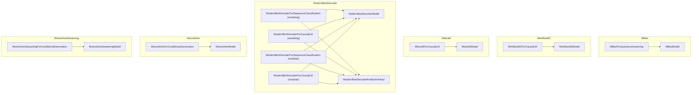

# language_models_part_10
This module encompasses various language model implementations, including question answering, causal language modeling, and conditional generation, across different architectures like MBart, MiniMaxM2, Mistral4, ModernBertDecoder, and Moonshine.

<!-- DIAGRAM_JSON
{
  "nodes": [
    {"id": "src.transformers.models.mbart.modeling_mbart.MBartForQuestionAnswering", "label": "MBartForQuestionAnswering"},
    {"id": "src.transformers.models.minimax_m2.modeling_minimax_m2.MiniMaxM2ForCausalLM", "label": "MiniMaxM2ForCausalLM"},
    {"id": "src.transformers.models.mistral4.modeling_mistral4.Mistral4ForCausalLM", "label": "Mistral4ForCausalLM"},
    {"id": "src.transformers.models.modernbert_decoder.modeling_modernbert_decoder.ModernBertDecoderForSequenceClassification", "label": "ModernBertDecoderForSequenceClassification (modeling)"},
    {"id": "src.transformers.models.modernbert_decoder.modeling_modernbert_decoder.ModernBertDecoderForCausalLM", "label": "ModernBertDecoderForCausalLM (modeling)"},
    {"id": "src.transformers.models.modernbert_decoder.modular_modernbert_decoder.ModernBertDecoderForSequenceClassification", "label": "ModernBertDecoderForSequenceClassification (modular)"},
    {"id": "src.transformers.models.modernbert_decoder.modular_modernbert_decoder.ModernBertDecoderForCausalLM", "label": "ModernBertDecoderForCausalLM (modular)"},
    {"id": "src.transformers.models.moonshine.modeling_moonshine.MoonshineForConditionalGeneration", "label": "MoonshineForConditionalGeneration"},
    {"id": "src.transformers.models.moonshine_streaming.modeling_moonshine_streaming.MoonshineStreamingForConditionalGeneration", "label": "MoonshineStreamingForConditionalGeneration"},
    {"id": "MBartModel", "label": "MBartModel"},
    {"id": "MiniMaxM2Model", "label": "MiniMaxM2Model"},
    {"id": "Mistral4Model", "label": "Mistral4Model"},
    {"id": "ModernBertDecoderModel", "label": "ModernBertDecoderModel"},
    {"id": "ModernBertDecoderPredictionHead", "label": "ModernBertDecoderPredictionHead"},
    {"id": "MoonshineModel", "label": "MoonshineModel"},
    {"id": "MoonshineStreamingModel", "label": "MoonshineStreamingModel"}
  ],
  "edges": [
    {"source": "src.transformers.models.mbart.modeling_mbart.MBartForQuestionAnswering", "target": "MBartModel", "label": "uses"},
    {"source": "src.transformers.models.minimax_m2.modeling_minimax_m2.MiniMaxM2ForCausalLM", "target": "MiniMaxM2Model", "label": "uses"},
    {"source": "src.transformers.models.mistral4.modeling_mistral4.Mistral4ForCausalLM", "target": "Mistral4Model", "label": "uses"},
    {"source": "src.transformers.models.modernbert_decoder.modeling_modernbert_decoder.ModernBertDecoderForSequenceClassification", "target": "ModernBertDecoderModel", "label": "uses"},
    {"source": "src.transformers.models.modernbert_decoder.modeling_modernbert_decoder.ModernBertDecoderForSequenceClassification", "target": "ModernBertDecoderPredictionHead", "label": "uses"},
    {"source": "src.transformers.models.modernbert_decoder.modeling_modernbert_decoder.ModernBertDecoderForCausalLM", "target": "ModernBertDecoderModel", "label": "uses"},
    {"source": "src.transformers.models.modernbert_decoder.modeling_modernbert_decoder.ModernBertDecoderForCausalLM", "target": "ModernBertDecoderPredictionHead", "label": "uses"},
    {"source": "src.transformers.models.modernbert_decoder.modular_modernbert_decoder.ModernBertDecoderForSequenceClassification", "target": "ModernBertDecoderModel", "label": "uses"},
    {"source": "src.transformers.models.modernbert_decoder.modular_modernbert_decoder.ModernBertDecoderForSequenceClassification", "target": "ModernBertDecoderPredictionHead", "label": "uses"},
    {"source": "src.transformers.models.modernbert_decoder.modular_modernbert_decoder.ModernBertDecoderForCausalLM", "target": "ModernBertDecoderModel", "label": "uses"},
    {"source": "src.transformers.models.modernbert_decoder.modular_modernbert_decoder.ModernBertDecoderForCausalLM", "target": "ModernBertDecoderPredictionHead", "label": "uses"},
    {"source": "src.transformers.models.moonshine.modeling_moonshine.MoonshineForConditionalGeneration", "target": "MoonshineModel", "label": "uses"},
    {"source": "src.transformers.models.moonshine_streaming.modeling_moonshine_streaming.MoonshineStreamingForConditionalGeneration", "target": "MoonshineStreamingModel", "label": "uses"}
  ],
  "groups": [
    {"id": "mbart", "label": "MBart", "nodes": ["src.transformers.models.mbart.modeling_mbart.MBartForQuestionAnswering", "MBartModel"]},
    {"id": "minimax_m2", "label": "MiniMaxM2", "nodes": ["src.transformers.models.minimax_m2.modeling_minimax_m2.MiniMaxM2ForCausalLM", "MiniMaxM2Model"]},
    {"id": "mistral4", "label": "Mistral4", "nodes": ["src.transformers.models.mistral4.modeling_mistral4.Mistral4ForCausalLM", "Mistral4Model"]},
    {"id": "modernbert_decoder", "label": "ModernBertDecoder", "nodes": ["src.transformers.models.modernbert_decoder.modeling_modernbert_decoder.ModernBertDecoderForSequenceClassification", "src.transformers.models.modernbert_decoder.modeling_modernbert_decoder.ModernBertDecoderForCausalLM", "src.transformers.models.modernbert_decoder.modular_modernbert_decoder.ModernBertDecoderForSequenceClassification", "src.transformers.models.modernbert_decoder.modular_modernbert_decoder.ModernBertDecoderForCausalLM", "ModernBertDecoderModel", "ModernBertDecoderPredictionHead"]},
    {"id": "moonshine", "label": "Moonshine", "nodes": ["src.transformers.models.moonshine.modeling_moonshine.MoonshineForConditionalGeneration", "MoonshineModel"]},
    {"id": "moonshine_streaming", "label": "MoonshineStreaming", "nodes": ["src.transformers.models.moonshine_streaming.modeling_moonshine_streaming.MoonshineStreamingForConditionalGeneration", "MoonshineStreamingModel"]}
  ]
}
-->
