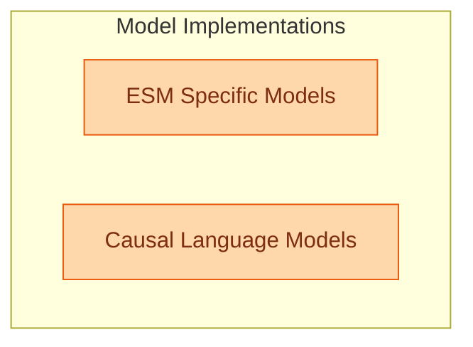

# Language Model Implementations Part 4
This module comprises various language model implementations, including specialized ESM models for masked language modeling and token classification, alongside several causal language models such as ExaoneMoe, FalconH1, FalconMamba, FlexOlmo, and Gemma2 for generative text tasks.

<!-- DIAGRAM_JSON
{
    "direction": "TD",
    "nodes": [
        {"id": "esm_specific_models", "label": "ESM Specific Models", "type": "module", "link": "esm_specific_models.md"},
        {"id": "causal_lm_models", "label": "Causal Language Models", "type": "module", "link": "causal_lm_models.md"}
    ],
    "edges": [],
    "groups": [
        {"id": "model_implementations", "label": "Model Implementations", "role": "generative", "nodes": ["esm_specific_models", "causal_lm_models"]}
    ]
}
-->

