# language_models_part_8
This module aggregates various language model implementations, including causal language models (JetMoe, Lfm2Moe, LongcatFlash) and sequence-to-sequence models (LED) for question answering and conditional generation tasks.

<!-- DIAGRAM_JSON
{
  "nodes": [
    {"id": "JetMoeForCausalLM", "label": "JetMoeForCausalLM"},
    {"id": "LEDForQuestionAnswering", "label": "LEDForQuestionAnswering"},
    {"id": "LEDForConditionalGeneration", "label": "LEDForConditionalGeneration"},
    {"id": "Lfm2MoeForCausalLM", "label": "Lfm2MoeForCausalLM"},
    {"id": "LongcatFlashForCausalLM", "label": "LongcatFlashForCausalLM"},
    {"id": "GenerationMixin", "label": "GenerationMixin"},
    {"id": "JetMoePreTrainedModel", "label": "JetMoePreTrainedModel"},
    {"id": "LEDPreTrainedModel", "label": "LEDPreTrainedModel"},
    {"id": "Lfm2MoePreTrainedModel", "label": "Lfm2MoePreTrainedModel"},
    {"id": "LongcatFlashPreTrainedModel", "label": "LongcatFlashPreTrainedModel"},
    {"id": "JetMoeModel", "label": "JetMoeModel"},
    {"id": "LEDModel", "label": "LEDModel"},
    {"id": "Lfm2MoeModel", "label": "Lfm2MoeModel"},
    {"id": "LongcatFlashModel", "label": "LongcatFlashModel"}
  ],
  "edges": [
    {"source": "JetMoeForCausalLM", "target": "JetMoePreTrainedModel", "type": "inherits"},
    {"source": "JetMoeForCausalLM", "target": "GenerationMixin", "type": "inherits"},
    {"source": "JetMoeForCausalLM", "target": "JetMoeModel", "type": "composes"},
    {"source": "LEDForQuestionAnswering", "target": "LEDPreTrainedModel", "type": "inherits"},
    {"source": "LEDForQuestionAnswering", "target": "LEDModel", "type": "composes"},
    {"source": "LEDForConditionalGeneration", "target": "LEDPreTrainedModel", "type": "inherits"},
    {"source": "LEDForConditionalGeneration", "target": "GenerationMixin", "type": "inherits"},
    {"source": "LEDForConditionalGeneration", "target": "LEDModel", "type": "composes"},
    {"source": "Lfm2MoeForCausalLM", "target": "Lfm2MoePreTrainedModel", "type": "inherits"},
    {"source": "Lfm2MoeForCausalLM", "target": "GenerationMixin", "type": "inherits"},
    {"source": "Lfm2MoeForCausalLM", "target": "Lfm2MoeModel", "type": "composes"},
    {"source": "LongcatFlashForCausalLM", "target": "LongcatFlashPreTrainedModel", "type": "inherits"},
    {"source": "LongcatFlashForCausalLM", "target": "GenerationMixin", "type": "inherits"},
    {"source": "LongcatFlashForCausalLM", "target": "LongcatFlashModel", "type": "composes"}
  ],
  "groups": [
    {"id": "JetMoe", "label": "JetMoe Components", "nodes": ["JetMoeForCausalLM", "JetMoePreTrainedModel", "JetMoeModel"]},
    {"id": "LED", "label": "LED Components", "nodes": ["LEDForQuestionAnswering", "LEDForConditionalGeneration", "LEDPreTrainedModel", "LEDModel"]},
    {"id": "Lfm2Moe", "label": "Lfm2Moe Components", "nodes": ["Lfm2MoeForCausalLM", "Lfm2MoePreTrainedModel", "Lfm2MoeModel"]},
    {"id": "LongcatFlash", "label": "LongcatFlash Components", "nodes": ["LongcatFlashForCausalLM", "LongcatFlashPreTrainedModel", "LongcatFlashModel"]}
  ]
}
-->

```mermaid
flowchart TD
    GenerationMixin

    subgraph JetMoe Components
        JetMoeForCausalLM -->|"inherits"| JetMoePreTrainedModel
        JetMoeForCausalLM -->|"inherits"| GenerationMixin
        JetMoeForCausalLM -->|"uses"| JetMoeModel
    end

    subgraph LED Components
        LEDForQuestionAnswering -->|"inherits"| LEDPreTrainedModel
        LEDForQuestionAnswering -->|"uses"| LEDModel
        LEDForConditionalGeneration -->|"inherits"| LEDPreTrainedModel
        LEDForConditionalGeneration -->|"inherits"| GenerationMixin
        LEDForConditionalGeneration -->|"uses"| LEDModel
    end

    subgraph Lfm2Moe Components
        Lfm2MoeForCausalLM -->|"inherits"| Lfm2MoePreTrainedModel
        Lfm2MoeForCausalLM -->|"inherits"| GenerationMixin
        Lfm2MoeForCausalLM -->|"uses"| Lfm2MoeModel
    end

    subgraph LongcatFlash Components
        LongcatFlashForCausalLM -->|"inherits"| LongcatFlashPreTrainedModel
        LongcatFlashForCausalLM -->|"inherits"| GenerationMixin
        LongcatFlashForCausalLM -->|"uses"| LongcatFlashModel
    end
```
