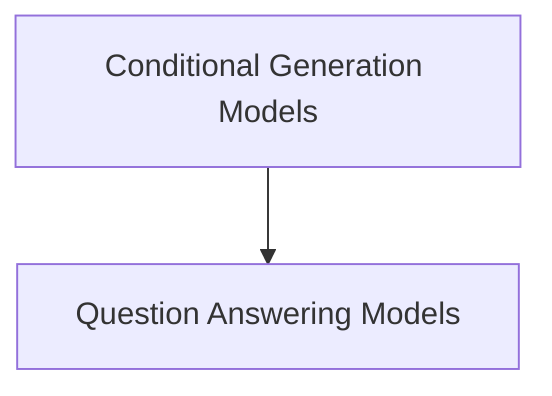

# LED Models

The `led_models` module provides implementations of the Longformer-Encoder-Decoder (LED) model for various natural language processing tasks. It extends the base LED model with task-specific heads, such as those for conditional generation and question answering.

## Architecture

The `led_models` module is structured into distinct sub-modules, each focusing on a specific application of the LED architecture. This modular design enhances maintainability and allows for clear separation of concerns.

<!-- DIAGRAM_JSON
{
    "direction": "TD",
    "nodes": [
        {"id": "conditional_generation_models", "label": "Conditional Generation Models", "type": "module", "link": "conditional_generation_models.md"},
        {"id": "question_answering_models", "label": "Question Answering Models", "type": "module", "link": "question_answering_models.md"}
    ],
    "edges": [
        {"source": "conditional_generation_models", "target": "question_answering_models"}
    ],
    "groups": []
}
-->

## Sub-modules

- [Conditional Generation Models](conditional_generation_models.md): This sub-module provides the `LEDForConditionalGeneration` model, designed for tasks such as summarization and masked language modeling.
- [Question Answering Models](question_answering_models.md): This sub-module contains the `LEDForQuestionAnswering` model, specifically tailored for extractive question answering tasks.