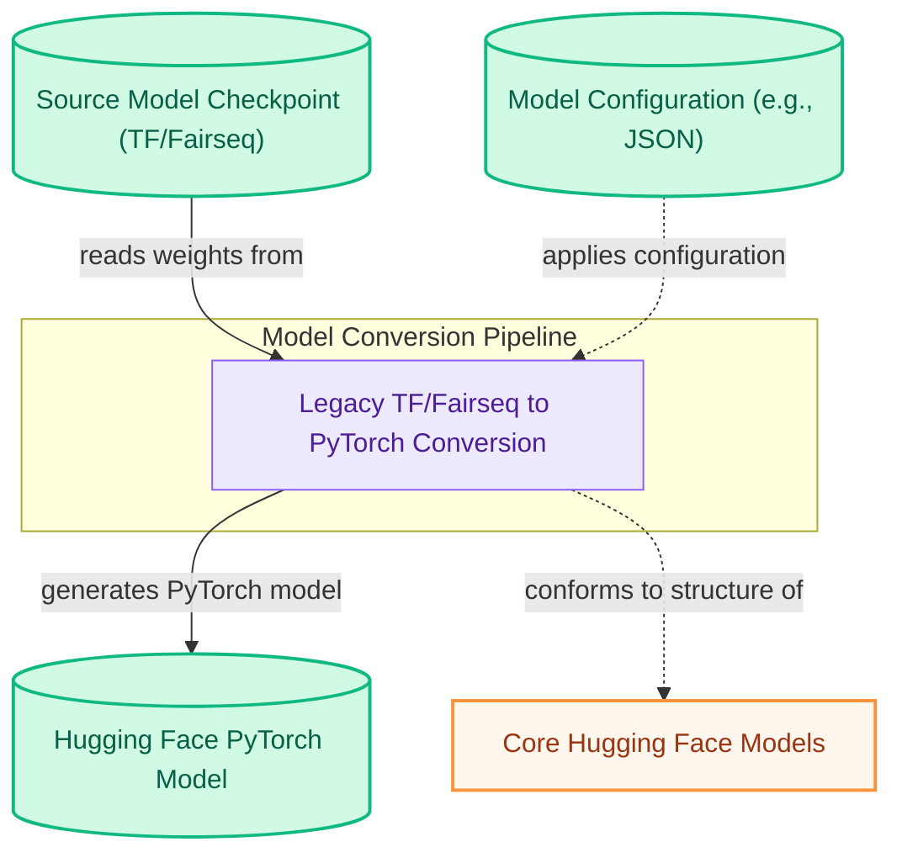

# Legacy TensorFlow and Fairseq Model Converters

This module provides scripts to convert legacy model checkpoints from TensorFlow and Fairseq formats into compatible Hugging Face PyTorch models, ensuring seamless integration with the Hugging Face ecosystem.

<!-- DIAGRAM_JSON
{
    "direction": "TD",
    "nodes": [
        {"id": "source_checkpoint", "label": "Source Model Checkpoint (TF/Fairseq)", "type": "data", "link": null},
        {"id": "model_configuration", "label": "Model Configuration (e.g., JSON)", "type": "data", "link": null},
        {"id": "conversion_process", "label": "Legacy TF/Fairseq to PyTorch Conversion", "type": "component", "link": null},
        {"id": "hf_pytorch_model_output", "label": "Hugging Face PyTorch Model", "type": "data", "link": null},
        {"id": "hf_core_models", "label": "Core Hugging Face Models", "type": "external", "link": "core_models.md"}
    ],
    "edges": [
        {"source": "source_checkpoint", "target": "conversion_process", "label": "reads weights from"},
        {"source": "model_configuration", "target": "conversion_process", "label": "applies configuration"},
        {"source": "conversion_process", "target": "hf_pytorch_model_output", "label": "generates PyTorch model"},
        {"source": "conversion_process", "target": "hf_core_models", "label": "conforms to structure of"}
    ],
    "groups": [
        {"id": "conversion_pipeline", "label": "Model Conversion Pipeline", "role": "analytical", "nodes": ["conversion_process"]}
    ]
}
-->

