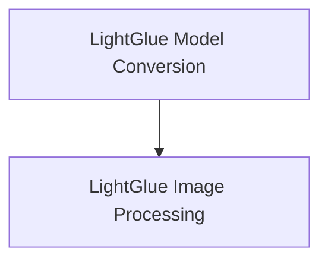

# LightGlue Models Documentation

The `lightglue_models` module provides core functionalities for working with LightGlue models, primarily focusing on model conversion and image processing for keypoint matching. LightGlue is a neural network for robust and fast feature matching.

## Architecture Overview

The `lightglue_models` module is composed of two main sub-modules:

1.  **Model Conversion**: Manages the conversion of LightGlue model checkpoints into the Hugging Face format, ensuring compatibility and ease of use within the ecosystem.
2.  **Image Processing**: Offers utilities for preparing images for LightGlue models and interpreting their keypoint matching outputs, including visualization tools.

<!-- DIAGRAM_JSON
{
    "direction": "TD",
    "nodes": [
        {"id": "model_conversion", "label": "LightGlue Model Conversion", "type": "module", "link": "model_conversion.md"},
        {"id": "image_processing", "label": "LightGlue Image Processing", "type": "module", "link": "image_processing.md"}
    ],
    "edges": [
        {"source": "model_conversion", "target": "image_processing"}
    ],
    "groups": []
}
-->

## Sub-modules

### [LightGlue Model Conversion](model_conversion.md)
This sub-module is responsible for converting LightGlue model checkpoints from their original format to a format compatible with Hugging Face Transformers. It includes utilities for fetching checkpoints, converting weights, and saving the processed models and their configurations.

### [LightGlue Image Processing](image_processing.md)
This sub-module provides essential tools for image manipulation tailored for LightGlue models. It handles image preprocessing steps such as resizing, rescaling, and grayscale conversion. Additionally, it offers post-processing functionalities for interpreting keypoint matching outputs, including the conversion of raw model outputs into structured keypoint data and visualization of matches.