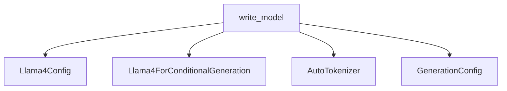

# llama4_models

## Introduction
The `llama4_models` module provides utilities for converting Llama4 model weights into a format compatible with the Hugging Face Transformers library. This module is essential for integrating Llama4 models into the Hugging Face ecosystem, enabling users to leverage the library's features for model loading, fine-tuning, and inference.

## Core Functionality
The primary functionality of this module revolves around the `write_model` function, which performs the following key operations:
-   **Configuration Parsing**: Reads and parses model parameters from a `params.json` file to construct `Llama4TextConfig` and `Llama4VisionConfig` objects, which are then combined into a `Llama4Config`.
-   **Weight Conversion**: Loads sharded or unsharded model checkpoints, renames parameters to match Hugging Face conventions, and applies complex transformations such as:
    -   Splitting `qkv_proj` into separate query (`q`), key (`k`), and value (`v`) projections for attention mechanisms.
    -   Handling Mixture-of-Experts (MoE) layers by splitting expert weights for offline quantization.
    -   Fusing `gate_proj` and `up_proj` into a single `gate_up_proj` for certain layers.
-   **Model Instantiation and Saving**: Initializes an empty `Llama4ForConditionalGeneration` model with the converted configuration, loads the transformed state dictionary, and saves the complete model in the Hugging Face format.
-   **Safety Check and Generation Configuration**: Reloads the converted model and performs a basic generation test to ensure correctness. It also saves a `GenerationConfig` if the model is an instruction-tuned variant.

## Architecture and Component Relationships

<!-- DIAGRAM_JSON
{
    "direction": "TD",
    "nodes": [
        {"id": "write_model", "label": "write_model", "type": "component", "link": null},
        {"id": "llama4_config", "label": "Llama4Config", "type": "external", "link": null},
        {"id": "llama4_for_conditional_generation", "label": "Llama4ForConditionalGeneration", "type": "external", "link": null},
        {"id": "auto_tokenizer", "label": "AutoTokenizer", "type": "external", "link": "tokenization_utilities.md"},
        {"id": "generation_config", "label": "GenerationConfig", "type": "external", "link": "generation_mixins.md"}
    ],
    "edges": [
        {"source": "write_model", "target": "llama4_config"},
        {"source": "write_model", "target": "llama4_for_conditional_generation"},
        {"source": "write_model", "target": "auto_tokenizer"},
        {"source": "write_model", "target": "generation_config"}
    ],
    "groups": []
}
-->

The `write_model` function (A) is the central component, responsible for orchestrating the conversion process. It interacts with the following external components:
-   **Llama4Config (B)**: The configuration class specific to Llama4 models. `write_model` generates and saves this configuration.
-   **Llama4ForConditionalGeneration (C)**: The main Llama4 model class used to load and save the converted weights.
-   **AutoTokenizer (D)**: Utilized during the safety check to tokenize input for model generation. Refer to the [tokenization_utilities module documentation](tokenization_utilities.md) for more details.
-   **GenerationConfig (E)**: Configures the generation parameters for the converted model, especially for instruction-tuned variants. Refer to the [generation_mixins module documentation](generation_mixins.md) for more details.

## Module Integration
The `llama4_models` module plays a crucial role in enabling the use of Llama4 models within the broader Hugging Face Transformers ecosystem. By converting the original model weights, it allows these powerful models to be easily loaded, fine-tuned, and utilized for various natural language processing and multimodal tasks alongside other models supported by the library. This module acts as a bridge, ensuring compatibility and facilitating wider adoption of Llama4 models.