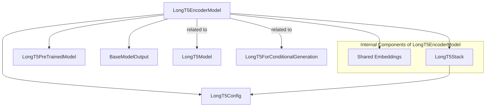

# LongT5EncoderModel

## Introduction

The `longt5_encoder_model` module provides the encoder-only architecture for the LongT5 model. It is designed to process long sequences of input tokens and generate contextually rich hidden states. This module is a fundamental component for tasks that require robust feature extraction from extended text inputs, such as document understanding, information retrieval, or as the encoding backbone for sequence-to-sequence models.

## Architecture and Component Relationships

The `LongT5EncoderModel` primarily encapsulates a `LongT5Stack` which serves as the actual encoder. It inherits from `LongT5PreTrainedModel`, providing common functionalities and weight management for LongT5 models. The model also manages shared input embeddings.

### Core Components

*   **`LongT5EncoderModel`**: The main class of this module, responsible for initializing and managing the encoder stack and input embeddings. It processes input IDs and attention masks to produce the encoder's hidden states.
*   **`shared` (Embedding Layer)**: An `nn.Embedding` layer used for converting input token IDs into dense vector representations. This layer is shared, as is common in T5-like architectures.
*   **`encoder` (`LongT5Stack`)**: The core of the encoder, an instance of `LongT5Stack`. This stack contains the transformer layers responsible for processing the embedded inputs and generating the hidden states.

### Dependencies

*   **`LongT5Config`**: Configuration class that defines the model's hyperparameters and architecture specifics. (Refer to [longt5_models.md](longt5_models.md) for more details on LongT5 configuration.)
*   **`LongT5PreTrainedModel`**: The base class for all LongT5 models, providing shared methods for weight initialization, saving, and loading. (Refer to [longt5_models.md](longt5_models.md) for the base model functionalities.)
*   **`BaseModelOutput`**: A standard output structure for models, typically containing the last hidden state and optionally attentions and hidden states. (Refer to [modeling_utilities.md](modeling_utilities.md) for general model utility definitions.)

## System Integration

The `longt5_encoder_model` module is an integral part of the broader `longt5_models` ecosystem. It can be used independently when only the encoding capabilities of LongT5 are required, or it can serve as the encoder part within a full LongT5 sequence-to-sequence model.

It is closely related to:

*   **`longt5_base_model`**: Represents the complete LongT5 model, typically including both an encoder and a decoder. (Refer to [longt5_base_model.md](longt5_base_model.md) for the full LongT5 model.)
*   **`longt5_conditional_generation`**: A specific LongT5 model tailored for conditional generation tasks, which internally utilizes an encoder (like this one) and a decoder. (Refer to [longt5_conditional_generation.md](longt5_conditional_generation.md) for conditional generation capabilities.)

This modular design allows for flexibility, enabling developers to use the encoder as a standalone component or as part of a larger LongT5-based system.

## Example Usage

```python
from transformers import AutoTokenizer, LongT5EncoderModel

tokenizer = AutoTokenizer.from_pretrained("google/long-t5-local-base")
model = LongT5EncoderModel.from_pretrained("google/long-t5-local-base")

# Prepare a long input sequence
input_text = 100 * "Studies have been shown that owning a dog is good for you "
input_ids = tokenizer(input_text, return_tensors="pt").input_ids

# Get encoder outputs
outputs = model(input_ids=input_ids)
last_hidden_states = outputs.last_hidden_state

print(f"Shape of last hidden states: {last_hidden_states.shape}")
```

<!-- DIAGRAM_JSON
{
    "direction": "TD",
    "nodes": [
        {"id": "longt5_encoder_model", "label": "LongT5EncoderModel", "type": "component", "link": null},
        {"id": "shared_embeddings", "label": "Shared Embeddings", "type": "component", "link": null},
        {"id": "longt5_stack", "label": "LongT5Stack", "type": "component", "link": null},
        {"id": "longt5_config", "label": "LongT5Config", "type": "external", "link": "longt5_models.md"},
        {"id": "longt5_pretrained_model", "label": "LongT5PreTrainedModel", "type": "external", "link": "longt5_models.md"},
        {"id": "base_model_output", "label": "BaseModelOutput", "type": "external", "link": "modeling_utilities.md"},
        {"id": "longt5_base_model", "label": "LongT5Model", "type": "external", "link": "longt5_base_model.md"},
        {"id": "longt5_conditional_generation", "label": "LongT5ForConditionalGeneration", "type": "external", "link": "longt5_conditional_generation.md"}
    ],
    "edges": [
        {"source": "longt5_encoder_model", "target": "longt5_pretrained_model"},
        {"source": "longt5_encoder_model", "target": "longt5_config"},
        {"source": "longt5_encoder_model", "target": "shared_embeddings"},
        {"source": "longt5_encoder_model", "target": "longt5_stack"},
        {"source": "longt5_encoder_model", "target": "base_model_output"},
        {"source": "longt5_stack", "target": "longt5_config"}
    ],
    "groups": [
        {"id": "internal_components", "label": "Internal Components of LongT5EncoderModel", "nodes": ["shared_embeddings", "longt5_stack"]}
    ]
}
-->

