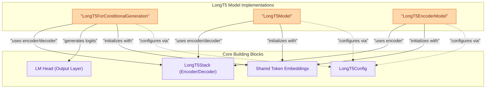

# LongT5 Models
This module provides the core LongT5 model implementations, including variants for conditional generation, the base encoder-decoder architecture, and an encoder-only model, all built upon a shared LongT5 transformer stack for processing long input sequences efficiently.

<!-- DIAGRAM_JSON
{
    "direction": "TD",
    "nodes": [
        {"id": "conditional_generation", "label": "LongT5ForConditionalGeneration", "type": "component", "link": null},
        {"id": "base_model", "label": "LongT5Model", "type": "component", "link": null},
        {"id": "encoder_only_model", "label": "LongT5EncoderModel", "type": "component", "link": null},
        {"id": "longt5_stack", "label": "LongT5Stack (Encoder/Decoder)", "type": "component", "link": null},
        {"id": "lm_head", "label": "LM Head (Output Layer)", "type": "component", "link": null},
        {"id": "shared_embeddings", "label": "Shared Token Embeddings", "type": "component", "link": null},
        {"id": "longt5_config", "label": "LongT5Config", "type": "component", "link": null}
    ],
    "edges": [
        {"source": "conditional_generation", "target": "longt5_stack", "label": "uses encoder/decoder"},
        {"source": "base_model", "target": "longt5_stack", "label": "uses encoder/decoder"},
        {"source": "encoder_only_model", "target": "longt5_stack", "label": "uses encoder"},
        {"source": "conditional_generation", "target": "lm_head", "label": "generates logits"},
        {"source": "conditional_generation", "target": "shared_embeddings", "label": "initializes with"},
        {"source": "base_model", "target": "shared_embeddings", "label": "initializes with"},
        {"source": "encoder_only_model", "target": "shared_embeddings", "label": "initializes with"},
        {"source": "conditional_generation", "target": "longt5_config", "label": "configures via"},
        {"source": "base_model", "target": "longt5_config", "label": "configures via"},
        {"source": "encoder_only_model", "target": "longt5_config", "label": "configures via"}
    ],
    "groups": [
        {"id": "longt5_model_implementations", "label": "LongT5 Model Implementations", "role": "generative", "nodes": ["conditional_generation", "base_model", "encoder_only_model"]},
        {"id": "core_components", "label": "Core Building Blocks", "role": "analytical", "nodes": ["longt5_stack", "lm_head", "shared_embeddings", "longt5_config"]}
    ]
}
-->
