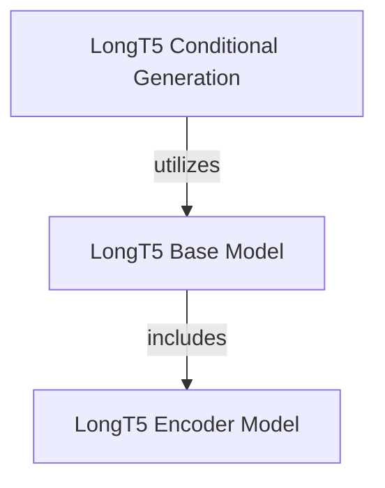

# LongT5 Models Documentation

## Introduction and Purpose

The `longt5_models` module provides various implementations of the LongT5 architecture, a transformer-based model specifically designed to efficiently handle longer input sequences compared to standard T5 models. It offers different configurations to support a range of natural language processing tasks, including conditional generation, generic encoder-decoder operations, and encoder-only functionalities.

## Architecture Overview

The LongT5 module is structured into three primary sub-modules, each catering to different use cases and offering distinct functionalities:
*   **LongT5 Base Model**: Implements the fundamental encoder-decoder architecture.
*   **LongT5 Conditional Generation**: Extends the base model with a language modeling head for sequence-to-sequence generation.
*   **LongT5 Encoder Model**: Provides an encoder-only configuration for tasks requiring only encoding input sequences.

<!-- DIAGRAM_JSON
{
    "direction": "TD",
    "nodes": [
        {"id": "longt5_base_model", "label": "LongT5 Base Model", "type": "module", "link": "longt5_base_model.md"},
        {"id": "longt5_conditional_generation", "label": "LongT5 Conditional Generation", "type": "module", "link": "longt5_conditional_generation.md"},
        {"id": "longt5_encoder_model", "label": "LongT5 Encoder Model", "type": "module", "link": "longt5_encoder_model.md"}
    ],
    "edges": [
        {"source": "longt5_conditional_generation", "target": "longt5_base_model", "label": "utilizes"},
        {"source": "longt5_base_model", "target": "longt5_encoder_model", "label": "includes"}
    ],
    "groups": []
}
-->

## High-Level Functionality of Sub-modules

### LongT5 Conditional Generation
This sub-module contains the `LongT5ForConditionalGeneration` class, which extends the base LongT5 model with a language modeling head for sequence-to-sequence conditional generation tasks such as summarization, translation, or text generation. It is designed for scenarios where the model needs to produce a coherent output sequence based on an input sequence.
For more in-depth information, refer to [longt5_conditional_generation.md](longt5_conditional_generation.md).

### LongT5 Base Model
This sub-module houses the `LongT5Model` class, which implements the complete encoder-decoder architecture of LongT5. It serves as a foundational component for tasks that require both encoding an input sequence and decoding an output sequence but without an additional task-specific head.
For more in-depth information, refer to [longt5_base_model.md](longt5_base_model.md).

### LongT5 Encoder Model
This sub-module includes the `LongT5EncoderModel` class, providing an encoder-only version of the LongT5 architecture. It is particularly useful for tasks like feature extraction, text embedding generation, or understanding input representations where no explicit decoding is required.
For more in-depth information, refer to [longt5_encoder_model.md](longt5_encoder_model.md).
