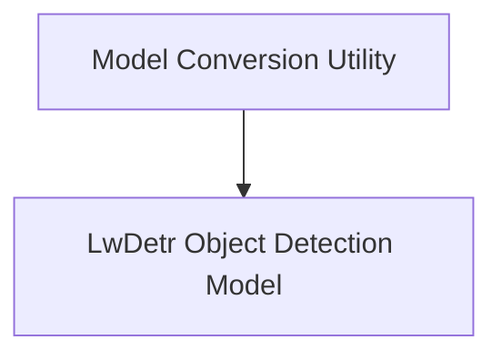

# LwDetr Models Documentation

## Introduction and Purpose

The `lw_detr_models` module implements the Light-Weight Detection Transformer (LwDetr) architecture, designed for efficient object detection. This module provides the core model for object detection tasks and utilities for converting pre-trained checkpoints into the Hugging Face format.

## Architecture Overview

The `lw_detr_models` module is structured into two main sub-modules:

1.  **Model Conversion Utility**: Handles the conversion of LwDetr checkpoints.
2.  **LwDetr Object Detection Model**: Contains the main `LwDetrForObjectDetection` class and its associated logic.

These components work together to provide a complete solution for deploying and utilizing LwDetr models.

<!-- DIAGRAM_JSON
{
    "direction": "TD",
    "nodes": [
        {"id": "model_conversion", "label": "Model Conversion Utility", "type": "module", "link": "model_conversion.md"},
        {"id": "object_detection_model", "label": "LwDetr Object Detection Model", "type": "module", "link": "object_detection_model.md"}
    ],
    "edges": [
        {"source": "model_conversion", "target": "object_detection_model"}
    ],
    "groups": []
}
-->

## Sub-module Functionality

### [Model Conversion Utility](model_conversion.md)

This sub-module provides the `main` function for converting LwDetr checkpoints. It supports downloading checkpoints from the Hugging Face Hub or using a locally provided path, and then converts them to the Hugging Face PyTorch format, with an option to push the converted model to the Hub.

### [LwDetr Object Detection Model](object_detection_model.md)

This sub-module encapsulates the `LwDetrForObjectDetection` class, which is the primary model for performing object detection. It includes the forward pass logic, the integration with the `LwDetrModel` backbone, class embedding, bounding box prediction, and loss computation. It also demonstrates how to use the model with an `AutoImageProcessor` for inference, providing concrete examples of its usage. This model is built upon the core `detr_models` for its image processing capabilities and the `modeling_utilities` for its base model functionalities, enhancing its object detection capabilities with efficient components. Reuses components from [detr_models.md](detr_models.md) for core image processing and base functionalities, and [modeling_utilities.md](modeling_utilities.md) for shared model utilities.
