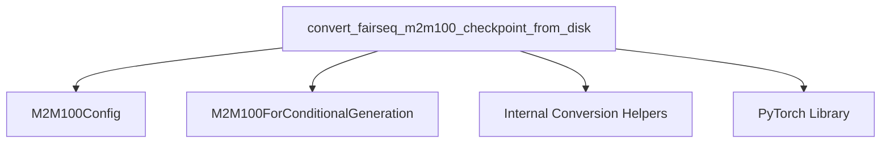

# m2m_100_models

The `m2m_100_models` module is responsible for handling the conversion of original Fairseq M2M-100 model checkpoints into the Hugging Face Transformers format. This module provides the necessary utility to load pre-trained M2M-100 models from their original format, configure them, and adapt them for use within the Transformers ecosystem.

## Core Functionality

The primary function within this module is `convert_fairseq_m2m100_checkpoint_from_disk`, which facilitates the seamless transition of M2M-100 models.

### `convert_fairseq_m2m100_checkpoint_from_disk`

`src.transformers.models.m2m_100.convert_m2m100_original_checkpoint_to_pytorch.convert_fairseq_m2m100_checkpoint_from_disk`

This function takes the path to an original Fairseq M2M-100 checkpoint and converts it into a Hugging Face Transformers `M2M100ForConditionalGeneration` model. It performs the following key operations:

1.  **Loading Checkpoint**: Loads the Fairseq checkpoint using PyTorch's `torch.load`.
2.  **Parameter Extraction**: Extracts model arguments and the state dictionary from the loaded checkpoint.
3.  **Key Transformation**: Utilizes internal helper functions, such as `remove_ignore_keys_`, to adapt the state dictionary keys to match the Transformers model's expected format.
4.  **Configuration Creation**: Constructs an `M2M100Config` based on the parameters extracted from the Fairseq checkpoint, ensuring the converted model has the correct architecture and hyperparameters.
5.  **Model Instantiation**: Initializes an `M2M100ForConditionalGeneration` model with the generated configuration.
6.  **State Dictionary Loading**: Loads the transformed state dictionary into the newly instantiated Transformers model.
7.  **Linear Head Creation**: Calls `make_linear_from_emb` to correctly set up the language model head, linking it to the shared embeddings.

This conversion process ensures that the M2M-100 model is fully compatible with the Transformers library, allowing users to leverage its features for conditional generation tasks.

## Architecture and Component Relationships

The `m2m_100_models` module primarily focuses on the conversion logic. It interacts with PyTorch for loading checkpoints and relies on the `M2M100Config` and `M2M100ForConditionalGeneration` classes for defining the target model's structure.

<!-- DIAGRAM_JSON
{
    "direction": "TD",
    "nodes": [
        {"id": "convert_m2m100", "label": "convert_fairseq_m2m100_checkpoint_from_disk", "type": "component", "link": null},
        {"id": "m2m100_config", "label": "M2M100Config", "type": "component", "link": null},
        {"id": "m2m100_model", "label": "M2M100ForConditionalGeneration", "type": "component", "link": null},
        {"id": "conversion_helpers", "label": "Internal Conversion Helpers", "type": "component", "link": null},
        {"id": "pytorch", "label": "PyTorch Library", "type": "external", "link": null}
    ],
    "edges": [
        {"source": "convert_m2m100", "target": "m2m100_config"},
        {"source": "convert_m2m100", "target": "m2m100_model"},
        {"source": "convert_m2m100", "target": "conversion_helpers"},
        {"source": "convert_m2m100", "target": "pytorch"}
    ],
    "groups": []
}
-->

## Integration with Overall System

The `m2m_100_models` module plays a crucial role in enabling the use of M2M-100 models within the Hugging Face Transformers library. By providing a clear and functional conversion path, it allows researchers and developers to leverage pre-trained Fairseq M2M-100 checkpoints without needing to reimplement the model architecture or conversion logic. It integrates with the broader `transformers` library by producing instances of `M2M100ForConditionalGeneration`, which can then be used with other Transformers utilities for inference, fine-tuning, or further development.
