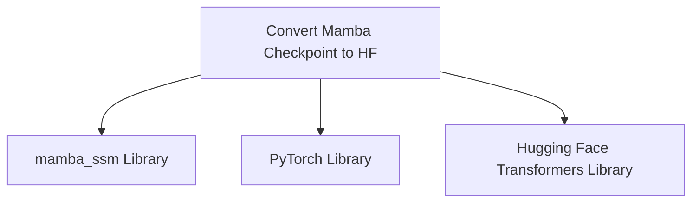

# `mamba_models`

The `mamba_models` module is dedicated to facilitating the integration of Mamba SSM models into the Hugging Face Transformers ecosystem. Its primary function is to provide utilities for converting Mamba SSM checkpoints into a format compatible with Hugging Face models, enabling seamless usage and further development within the Transformers library.

### Purpose and Core Functionality

The core functionality of the `mamba_models` module revolves around the conversion of Mamba SSM model checkpoints. Specifically, it offers a robust mechanism to:
1.  **Load Mamba SSM Checkpoints**: Efficiently load original Mamba SSM model weights and configuration from specified paths.
2.  **Convert to Hugging Face Format**: Transform the loaded Mamba SSM components into their corresponding Hugging Face Transformers model and tokenizer representations.
3.  **Validate Conversion**: Ensure the integrity and correctness of the conversion process, verifying that the converted model behaves as expected.
4.  **Save Converted Models**: Persist the newly converted Hugging Face compatible models and tokenizers to a designated output directory.

This module is crucial for users and developers who wish to leverage the Mamba SSM architecture within the standardized and widely adopted Hugging Face environment, allowing them to benefit from the extensive tools and features provided by the Transformers library, such as easy loading, fine-tuning, and deployment.

### Architecture and Component Relationships

The `mamba_models` module, as a leaf module, is centered around a single key utility function for model conversion.

**Core Components:**

*   `convert_mamba_checkpoint_file_to_huggingface_model_file`: This is the main entry point for the conversion process. It orchestrates the loading of original Mamba SSM weights and configuration, performs the conversion, validates the output, and saves the Hugging Face compatible model and tokenizer.

**External Dependencies:**

The conversion process relies on several external libraries:

*   **`mamba_ssm` Library**: Essential for checking the availability of the original Mamba SSM environment and potentially for internal aspects of the conversion logic related to Mamba's architecture.
*   **`PyTorch` Library**: Utilized for loading the original model's state dictionary and for general tensor operations, especially given the CUDA requirement of the original Mamba SSM models.
*   **`Hugging Face Transformers Library`**: The target ecosystem for the conversion. The converted models and tokenizers conform to this library's standards, and its `save_pretrained` methods are used to store the output.

The relationship diagram below illustrates the central role of the `convert_mamba_checkpoint_file_to_huggingface_model_file` function and its dependencies.

<!-- DIAGRAM_JSON
{
    "direction": "TD",
    "nodes": [
        {"id": "convert_mamba_checkpoint_file_to_huggingface_model_file", "label": "Convert Mamba Checkpoint to HF", "type": "component", "link": null},
        {"id": "mamba_ssm_library", "label": "mamba_ssm Library", "type": "external", "link": null},
        {"id": "torch_library", "label": "PyTorch Library", "type": "external", "link": null},
        {"id": "huggingface_transformers", "label": "Hugging Face Transformers Library", "type": "external", "link": null}
    ],
    "edges": [
        {"source": "convert_mamba_checkpoint_file_to_huggingface_model_file", "target": "mamba_ssm_library"},
        {"source": "convert_mamba_checkpoint_file_to_huggingface_model_file", "target": "torch_library"},
        {"source": "convert_mamba_checkpoint_file_to_huggingface_model_file", "target": "huggingface_transformers"}
    ],
    "groups": []
}
-->

### How the Module Fits into the Overall System

The `mamba_models` module acts as an **adapter layer** within the broader Hugging Face Transformers ecosystem. It enables the ingestion and standardization of models developed using the Mamba SSM framework. By providing a clear conversion path, it expands the range of architectures supported by the Transformers library without requiring extensive refactoring of the original Mamba SSM implementations.

This module is particularly important for:

*   **Interoperability**: Bridging Mamba SSM with the vast array of tools and pipelines available in Hugging Face Transformers.
*   **Community Contribution**: Allowing researchers and developers working with Mamba SSM to easily share their models with the Hugging Face community.
*   **Simplified Usage**: Providing a straightforward process for users to load pre-trained Mamba SSM models directly through the Hugging Face API, benefiting from features like `AutoModel` and `AutoTokenizer`.

It contributes to making the Transformers library a more comprehensive platform by integrating emerging and specialized model architectures like Mamba SSM.