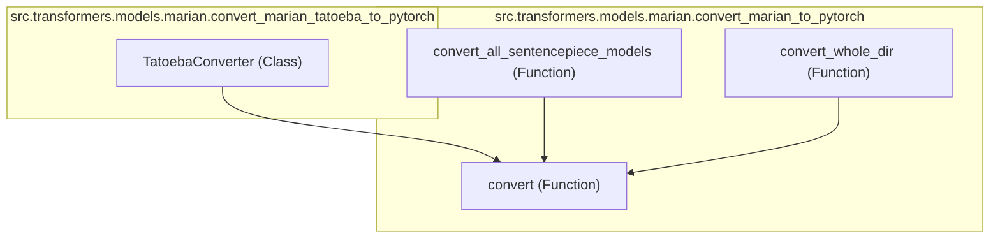

# marian_converters
This module provides tools for converting MarianMT models, including those from the Tatoeba-Challenge and general SentencePiece models, into the Hugging Face Transformers format. It centralizes the conversion logic for various Marian model sources.

<!-- DIAGRAM_JSON
{
  "nodes": [
    {"id": "TatoebaConverter_C", "label": "TatoebaConverter", "type": "class"},
    {"id": "convert_all_F", "label": "convert_all_sentencepiece_models", "type": "function"},
    {"id": "convert_F", "label": "convert", "type": "function"},
    {"id": "convert_whole_F", "label": "convert_whole_dir", "type": "function"}
  ],
  "edges": [
    {"source": "TatoebaConverter_C", "target": "convert_F", "label": "calls"},
    {"source": "convert_all_F", "target": "convert_F", "label": "calls"},
    {"source": "convert_whole_F", "target": "convert_F", "label": "calls"}
  ],
  "groups": [
    {"id": "tatoeba_file", "label": "src.transformers.models.marian.convert_marian_tatoeba_to_pytorch", "nodes": ["TatoebaConverter_C"]},
    {"id": "marian_file", "label": "src.transformers.models.marian.convert_marian_to_pytorch", "nodes": ["convert_all_F", "convert_F", "convert_whole_F"]}
  ]
}
-->
