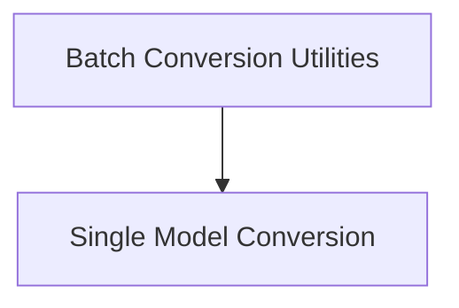

# Marian Model Conversion

The `marian_model_conversion` module is responsible for converting Marian NMT (Neural Machine Translation) models, specifically those using SentencePiece tokenization, into a format compatible with Hugging Face Transformers. This facilitates the use of Marian models within the Hugging Face ecosystem, enabling seamless integration and deployment.

## Architecture Overview

This module is structured into utilities for handling both individual model conversions and batch operations across multiple models or directories. It leverages internal states to manage the conversion process, including tokenizer and model saving.

<!-- DIAGRAM_JSON
{
    "direction": "TD",
    "nodes": [
        {"id": "batch_conversion_utilities", "label": "Batch Conversion Utilities", "type": "module", "link": "batch_conversion_utilities.md"},
        {"id": "single_model_conversion", "label": "Single Model Conversion", "type": "module", "link": "single_model_conversion.md"}
    ],
    "edges": [
        {"source": "batch_conversion_utilities", "target": "single_model_conversion"}
    ],
    "groups": []
}
-->

## Sub-modules

### [Batch Conversion Utilities](batch_conversion_utilities.md)
This sub-module provides functionalities for converting multiple Marian SentencePiece models or an entire directory of models. It simplifies the process of migrating a collection of Marian models.

### [Single Model Conversion](single_model_conversion.md)
This sub-module focuses on the conversion of a single Marian model from its source directory to a Hugging Face compatible format. It handles the specific steps required for an individual model, including tokenizer and model saving.