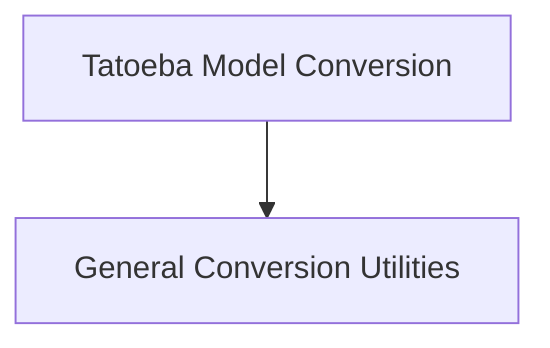

# Marian Models Documentation

## Introduction
The `marian_models` module is dedicated to the conversion of Marian machine translation models into the Hugging Face Transformers format. It provides utilities for handling various Marian model types, with a specific focus on models from the Tatoeba-Challenge and general SentencePiece models. This module ensures compatibility and seamless integration of Marian models within the Hugging Face ecosystem.

## Architecture Overview
The `marian_models` module is structured into specialized sub-modules to manage different aspects of the conversion process. The `tatoeba_conversion` sub-module handles the unique requirements of Tatoeba-Challenge models, while the `general_conversion_utilities` sub-module provides core functionalities for broader Marian model conversion tasks.

<!-- DIAGRAM_JSON
{
    "direction": "TD",
    "nodes": [
        {"id": "tatoeba_conversion", "label": "Tatoeba Model Conversion", "type": "module", "link": "tatoeba_conversion.md"},
        {"id": "general_conversion_utilities", "label": "General Conversion Utilities", "type": "module", "link": "general_conversion_utilities.md"}
    ],
    "edges": [
        {"source": "tatoeba_conversion", "target": "general_conversion_utilities"}
    ],
    "groups": []
}
-->

## High-Level Functionality

### [Tatoeba Model Conversion](tatoeba_conversion.md)
This sub-module contains the `TatoebaConverter` class, which is responsible for converting Tatoeba-Challenge models to the Hugging Face format, including parsing metadata, resolving language codes, and generating model cards.

### [General Conversion Utilities](general_conversion_utilities.md)
This sub-module offers general-purpose functions like `convert_all_sentencepiece_models`, `convert`, and `convert_whole_dir` for batch and individual Marian model conversions, primarily for SentencePiece-based models.
