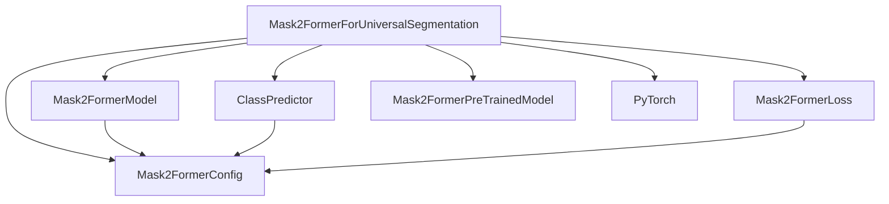

# `mask2former_models`

The `mask2former_models` module is a core component for universal image segmentation, providing a robust and flexible architecture capable of performing instance, semantic, and panoptic segmentation tasks. It leverages the Mask2Former model architecture to achieve state-of-the-art results across various vision tasks.

### Purpose and Core Functionality

The primary purpose of the `mask2former_models` module is to provide the `Mask2FormerForUniversalSegmentation` class, which serves as the main entry point for using the Mask2Former model for a wide range of image segmentation applications. This class encapsulates the entire Mask2Former model, including its encoder, pixel decoder, transformer decoder, and the necessary components for loss calculation and prediction.

Key functionalities include:

*   **Universal Segmentation:** Capable of performing instance, semantic, and panoptic segmentation from a single model.
*   **Flexible Configuration:** Utilizes a `Mask2FormerConfig` object to configure various aspects of the model, such as the number of labels, hidden dimensions, and loss weights.
*   **Loss Calculation:** Integrates `Mask2FormerLoss` to compute comprehensive loss values, including cross-entropy, mask, and dice losses, with configurable weights.
*   **Auxiliary Logits:** Supports the output of auxiliary logits for intermediate decoder stages, which can be useful for training stability and analysis.
*   **Post-processing Integration:** Designed to work seamlessly with an `AutoImageProcessor` for pre-processing inputs and post-processing model outputs to generate final segmentation maps.

### Architecture and Component Relationships

The `mask2former_models` module, specifically the `Mask2FormerForUniversalSegmentation` class, is structured to provide a clear separation of concerns, integrating several key components to achieve its functionality.

**Internal Components:**

*   **`Mask2FormerForUniversalSegmentation`**: The main class, responsible for orchestrating the entire segmentation pipeline. It initializes the core model, defines the classification head, and manages the loss computation.
*   **`Mask2FormerModel`**: This component represents the backbone of the Mask2Former architecture, handling the feature extraction and multi-scale feature representation.
*   **`ClassPredictor`**: A linear layer that predicts the class probabilities for each query generated by the transformer decoder.
*   **`Mask2FormerLoss`**: The dedicated loss function that computes the various segmentation losses (cross-entropy, mask, dice) based on the model's predictions and ground-truth labels.

**External Dependencies:**

*   **`Mask2FormerConfig`**: Defines the hyperparameters and architectural details of the Mask2Former model. Refer to [mask2former_config.md](mask2former_config.md) for more details.
*   **`Mask2FormerPreTrainedModel`**: The base class from which `Mask2FormerForUniversalSegmentation` inherits, providing common functionalities such as weight initialization and model loading. Refer to [modeling_utils.md](modeling_utils.md) for more details.
*   **PyTorch (`torch.nn`, `torch`)**: Core deep learning library used for tensor operations, neural network modules, and model training.

<!-- DIAGRAM_JSON
{
    "direction": "TD",
    "nodes": [
        {"id": "Mask2FormerForUniversalSegmentation", "label": "Mask2FormerForUniversalSegmentation", "type": "component", "link": null},
        {"id": "Mask2FormerModel", "label": "Mask2FormerModel", "type": "component", "link": null},
        {"id": "ClassPredictor", "label": "ClassPredictor", "type": "component", "link": null},
        {"id": "Mask2FormerLoss", "label": "Mask2FormerLoss", "type": "component", "link": null},
        {"id": "Mask2FormerConfig", "label": "Mask2FormerConfig", "type": "external", "link": "mask2former_config.md"},
        {"id": "Mask2FormerPreTrainedModel", "label": "Mask2FormerPreTrainedModel", "type": "external", "link": "modeling_utils.md"},
        {"id": "PyTorch", "label": "PyTorch", "type": "external", "link": null}
    ],
    "edges": [
        {"source": "Mask2FormerForUniversalSegmentation", "target": "Mask2FormerModel"},
        {"source": "Mask2FormerForUniversalSegmentation", "target": "ClassPredictor"},
        {"source": "Mask2FormerForUniversalSegmentation", "target": "Mask2FormerLoss"},
        {"source": "Mask2FormerForUniversalSegmentation", "target": "Mask2FormerConfig"},
        {"source": "Mask2FormerForUniversalSegmentation", "target": "Mask2FormerPreTrainedModel"},
        {"source": "Mask2FormerForUniversalSegmentation", "target": "PyTorch"},
        {"source": "Mask2FormerModel", "target": "Mask2FormerConfig"},
        {"source": "ClassPredictor", "target": "Mask2FormerConfig"},
        {"source": "Mask2FormerLoss", "target": "Mask2FormerConfig"}
    ],
    "groups": []
}
-->


### How the Module Fits into the Overall System

The `mask2former_models` module plays a crucial role in any system requiring advanced image segmentation capabilities. It serves as a high-level abstraction for the Mask2Former architecture, allowing developers to easily integrate state-of-the-art universal segmentation into their applications.

Typically, this module would be used in conjunction with:

*   **Image Pre-processors:** Modules like `AutoImageProcessor` (e.g., from the `image_utilities` or `image_feature_extraction` modules) are essential for preparing input images into the format expected by the Mask2Former model.
*   **Downstream Tasks:** The output segmentation maps (instance, semantic, or panoptic) can then be fed into various downstream tasks such as object detection, image editing, robotic perception, or medical image analysis.
*   **Training Pipelines:** The `Mask2FormerForUniversalSegmentation` class is designed to be easily integrated into training pipelines, accepting ground-truth masks and class labels for supervised learning.

### Code Examples

The `Mask2FormerForUniversalSegmentation` class provides comprehensive functionality for various segmentation tasks. Below are examples demonstrating its usage for instance, semantic, and panoptic segmentation.

**Instance segmentation example:**

```python
from transformers import AutoImageProcessor, Mask2FormerForUniversalSegmentation
from PIL import Image
import httpx
from io import BytesIO
import torch

# Load Mask2Former trained on COCO instance segmentation dataset
image_processor = AutoImageProcessor.from_pretrained("facebook/mask2former-swin-small-coco-instance")
model = Mask2FormerForUniversalSegmentation.from_pretrained(
    "facebook/mask2former-swin-small-coco-instance"
)

url = "http://images.cocodataset.org/val2017/000000039769.jpg"
with httpx.stream("GET", url) as response:
    image = Image.open(BytesIO(response.read()))
inputs = image_processor(image, return_tensors="pt")

with torch.no_grad():
    outputs = model(**inputs)

# Model predicts class_queries_logits of shape `(batch_size, num_queries)`
# and masks_queries_logits of shape `(batch_size, num_queries, height, width)`
class_queries_logits = outputs.class_queries_logits
masks_queries_logits = outputs.masks_queries_logits

# Perform post-processing to get instance segmentation map
pred_instance_map = image_processor.post_process_instance_segmentation(
    outputs, target_sizes=[(image.height, image.width)]
)[0]
print(pred_instance_map.shape)
```

**Semantic segmentation example:**
```python
from transformers import AutoImageProcessor, Mask2FormerForUniversalSegmentation
from PIL import Image
import httpx
from io import BytesIO
import torch

# Load Mask2Former trained on ADE20k semantic segmentation dataset
image_processor = AutoImageProcessor.from_pretrained("facebook/mask2former-swin-small-ade-semantic")
model = Mask2FormerForUniversalSegmentation.from_pretrained("facebook/mask2former-swin-small-ade-semantic")

url = (
    "https://huggingface.co/datasets/hf-internal-testing/fixtures_ade20k/resolve/main/ADE_val_00000001.jpg"
)
with httpx.stream("GET", url) as response:
    image = Image.open(BytesIO(response.read()))
inputs = image_processor(image, return_tensors="pt")

with torch.no_grad():
    outputs = model(**inputs)

# Model predicts class_queries_logits of shape `(batch_size, num_queries)`
# and masks_queries_logits of shape `(batch_size, num_queries, height, width)`
class_queries_logits = outputs.class_queries_logits
masks_queries_logits = outputs.masks_queries_logits

# Perform post-processing to get semantic segmentation map
pred_semantic_map = image_processor.post_process_semantic_segmentation(
    outputs, target_sizes=[(image.height, image.width)]
)[0]
print(pred_semantic_map.shape)
```

**Panoptic segmentation example:**

```python
from transformers import AutoImageProcessor, Mask2FormerForUniversalSegmentation
from PIL import Image
import httpx
from io import BytesIO
import torch

# Load Mask2Former trained on CityScapes panoptic segmentation dataset
image_processor = AutoImageProcessor.from_pretrained("facebook/mask2former-swin-small-cityscapes-panoptic")
model = Mask2FormerForUniversalSegmentation.from_pretrained(
    "facebook/mask2former-swin-small-cityscapes-panoptic"
)

url = "https://cdn-media.huggingface.co/Inference-API/Sample-results-on-the-Cityscapes-dataset-The-above-images-show-how-our-method-can-handle.png"
with httpx.stream("GET", url) as response:
    image = Image.open(BytesIO(response.read()))
inputs = image_processor(image, return_tensors="pt")

with torch.no_grad():
    outputs = model(**inputs)

# Model predicts class_queries_logits of shape `(batch_size, num_queries)`
# and masks_queries_logits of shape `(batch_size, num_queries, height, width)`
class_queries_logits = outputs.class_queries_logits
masks_queries_logits = outputs.masks_queries_logits

# Perform post-processing to get panoptic segmentation map
pred_panoptic_map = image_processor.post_process_panoptic_segmentation(
    outputs, target_sizes=[(image.height, image.width)]
)[0]["segmentation"]
print(pred_panoptic_map.shape)
```