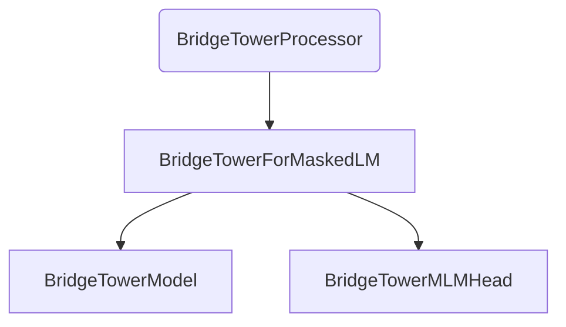

# masked_lm

The `masked_lm` module provides the `BridgeTowerForMaskedLM` class, a model designed for Masked Language Modeling (MLM) tasks within the BridgeTower multimodal framework. This module enables the prediction of masked tokens in text sequences, leveraging both textual and visual information.

## Core Functionality

The `BridgeTowerForMaskedLM` class extends `BridgeTowerPreTrainedModel` and integrates the core `BridgeTowerModel` for multimodal feature extraction and a `BridgeTowerMLMHead` for predicting masked tokens. It is particularly useful for tasks requiring a deep understanding of context from both text and images to infer missing words.

### BridgeTowerForMaskedLM

-   **Purpose**: Performs Masked Language Modeling by taking multimodal inputs (text `input_ids`, `attention_mask`, `token_type_ids`, and image `pixel_values`, `pixel_mask`) and predicting the masked tokens in the input text.
-   **Inputs**:
    -   `input_ids`: Token IDs for the input text.
    -   `attention_mask`: Attention mask for the input text.
    -   `token_type_ids`: Token type IDs for the input text.
    -   `pixel_values`: Pixel values for the input image.
    -   `pixel_mask`: Pixel mask for the input image.
    -   `inputs_embeds`: Optionally, pre-computed text embeddings.
    -   `image_embeds`: Optionally, pre-computed image embeddings.
    -   `labels`: Ground truth labels for computing the masked language modeling loss.
-   **Outputs**: Returns a `MaskedLMOutput` object containing:
    -   `loss`: The masked language modeling loss (if `labels` are provided).
    -   `logits`: The prediction scores for the masked tokens.
    -   `hidden_states`: Hidden states from the core BridgeTower model.
    -   `attentions`: Attention weights from the core BridgeTower model.
-   **Usage Example**: The provided example demonstrates how to use `BridgeTowerProcessor` to prepare image and text inputs and then perform a forward pass with `BridgeTowerForMaskedLM` to predict a masked token.

```python
>>> from transformers import BridgeTowerProcessor, BridgeTowerForMaskedLM
>>> from PIL import Image
>>> import httpx
>>> from io import BytesIO

>>> url = "http://images.cocodataset.org/val2017/000000360943.jpg"
>>> with httpx.stream("GET", url) as response:
...     image = Image.open(BytesIO(response.read())).convert("RGB")
>>> text = "a <mask> looking out of the window"

>>> processor = BridgeTowerProcessor.from_pretrained("BridgeTower/bridgetower-base-itm-mlm")
>>> model = BridgeTowerForMaskedLM.from_pretrained("BridgeTower/bridgetower-base-itm-mlm")

>>> # prepare inputs
>>> encoding = processor(image, text, return_tensors="pt")

>>> # forward pass
>>> outputs = model(**encoding)

>>> results = processor.decode(outputs.logits.argmax(dim=-1).squeeze(0).tolist())

>>> print(results)
.a cat looking out of the window.
```

## Architecture Diagram

This diagram illustrates the internal components of the `masked_lm` module and its primary external dependency for input processing.

<!-- DIAGRAM_JSON
{
    "direction": "TD",
    "nodes": [
        {"id": "bridgetower_masked_lm", "label": "BridgeTowerForMaskedLM", "type": "component", "link": null},
        {"id": "bridgetower_model_core", "label": "BridgeTowerModel", "type": "component", "link": null},
        {"id": "bridgetower_mlm_head", "label": "BridgeTowerMLMHead", "type": "component", "link": null},
        {"id": "bridgetower_processor", "label": "BridgeTowerProcessor", "type": "external", "link": "bridgetower_models.md"}
    ],
    "edges": [
        {"source": "bridgetower_masked_lm", "target": "bridgetower_model_core"},
        {"source": "bridgetower_masked_lm", "target": "bridgetower_mlm_head"},
        {"source": "bridgetower_processor", "target": "bridgetower_masked_lm"}
    ],
    "groups": []
}
-->


## Module Relationships

The `masked_lm` module is a specialized component within the broader [bridgetower_models](bridgetower_models.md) ecosystem, providing a specific task head for Masked Language Modeling. It relies on the fundamental `BridgeTowerModel` for its multimodal capabilities and typically interacts with a `BridgeTowerProcessor` for data preparation.
