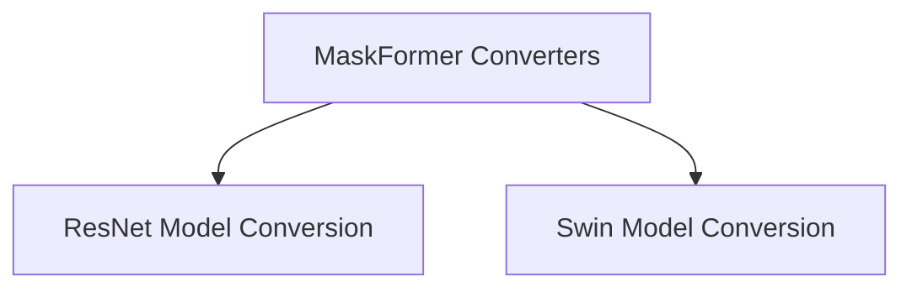

# MaskFormer Converters Module

The `maskformer_converters` module is responsible for facilitating the conversion of MaskFormer model checkpoints, specifically those utilizing different backbone architectures like ResNet and Swin Transformers, into a standardized PyTorch format. This ensures compatibility and ease of use within the Hugging Face Transformers ecosystem.

## Architecture Overview

This module acts as a central point for handling the conversion logic. It delegates the specific conversion tasks to dedicated sub-modules, each tailored to a particular backbone architecture. This modular approach allows for flexible extension to support new backbones without affecting existing conversion processes.

<!-- DIAGRAM_JSON
{
    "direction": "TD",
    "nodes": [
        {"id": "maskformer_converters", "label": "MaskFormer Converters", "type": "module"},
        {"id": "resnet_conversion", "label": "ResNet Model Conversion", "type": "module", "link": "resnet_conversion.md"},
        {"id": "swin_conversion", "label": "Swin Model Conversion", "type": "module", "link": "swin_conversion.md"}
    ],
    "edges": [
        {"source": "maskformer_converters", "target": "resnet_conversion"},
        {"source": "maskformer_converters", "target": "swin_conversion"}
    ],
    "groups": []
}
-->

## Sub-modules

*   ### [ResNet Model Conversion](resnet_conversion.md)
    Handles the conversion of MaskFormer models with ResNet backbones to the PyTorch format.

*   ### [Swin Model Conversion](swin_conversion.md)
    Manages the conversion of MaskFormer models with Swin Transformer backbones to the PyTorch format.