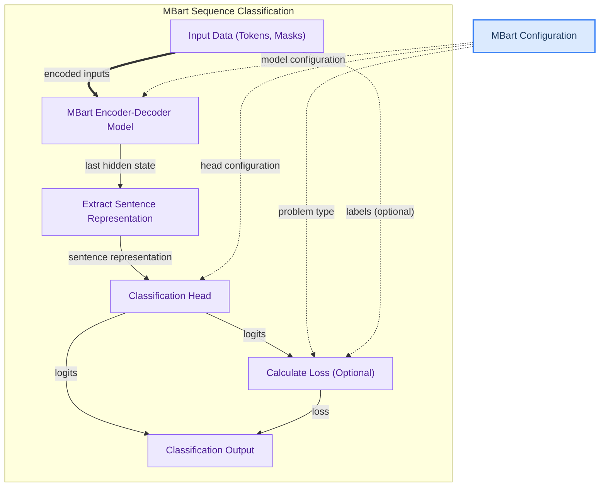

# MBart Sequence Classification
This module implements sequence classification using the MBart model, processing input tokens to generate sentence representations which are then passed to a classification head for predicting labels and calculating loss.

<!-- DIAGRAM_JSON
{
    "direction": "TD",
    "nodes": [
        {
            "id": "input_data",
            "label": "Input Data (Tokens, Masks)",
            "type": "component",
            "link": null
        },
        {
            "id": "mbart_model",
            "label": "MBart Encoder-Decoder Model",
            "type": "component",
            "link": null
        },
        {
            "id": "extract_rep",
            "label": "Extract Sentence Representation",
            "type": "component",
            "link": null
        },
        {
            "id": "classification_head",
            "label": "Classification Head",
            "type": "component",
            "link": null
        },
        {
            "id": "loss_calc",
            "label": "Calculate Loss (Optional)",
            "type": "component",
            "link": null
        },
        {
            "id": "output",
            "label": "Classification Output",
            "type": "component",
            "link": null
        },
        {
            "id": "mbart_config",
            "label": "MBart Configuration",
            "type": "external",
            "link": "mbart_models.md"
        }
    ],
    "edges": [
        {
            "source": "input_data",
            "target": "mbart_model",
            "label": "encoded inputs"
        },
        {
            "source": "mbart_model",
            "target": "extract_rep",
            "label": "last hidden state"
        },
        {
            "source": "extract_rep",
            "target": "classification_head",
            "label": "sentence representation"
        },
        {
            "source": "classification_head",
            "target": "loss_calc",
            "label": "logits"
        },
        {
            "source": "classification_head",
            "target": "output",
            "label": "logits"
        },
        {
            "source": "loss_calc",
            "target": "output",
            "label": "loss"
        },
        {
            "source": "mbart_config",
            "target": "mbart_model",
            "label": "model configuration"
        },
        {
            "source": "mbart_config",
            "target": "classification_head",
            "label": "head configuration"
        },
        {
            "source": "mbart_config",
            "target": "loss_calc",
            "label": "problem type"
        },
        {
            "source": "input_data",
            "target": "loss_calc",
            "label": "labels (optional)"
        }
    ],
    "groups": [
        {
            "id": "classification_pipeline",
            "label": "MBart Sequence Classification",
            "role": "analytical",
            "nodes": [
                "input_data",
                "mbart_model",
                "extract_rep",
                "classification_head",
                "loss_calc",
                "output"
            ]
        }
    ]
}
-->
