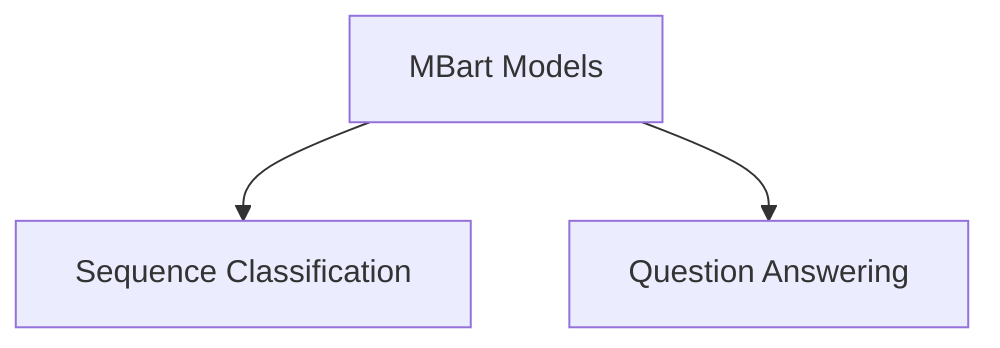

# MBart Model Implementations

This module provides specific implementations of the MBart model for various downstream tasks. It extends the core MBart model with task-specific heads, enabling functionalities like sequence classification and question answering. This module is part of the larger [mbart_models](mbart_models.md) family.

## Architecture Overview

The `mbart_model_implementations` module builds upon the foundational MBart model. It consists of specialized sub-modules, each designed to handle a distinct NLP task by adding a dedicated head on top of the MBart encoder-decoder architecture.

<!-- DIAGRAM_JSON
{
    "direction": "TD",
    "nodes": [
        {"id": "mbart_models", "label": "MBart Models", "type": "external", "link": "mbart_models.md"},
        {"id": "sequence_classification", "label": "Sequence Classification", "type": "module", "link": "sequence_classification.md"},
        {"id": "question_answering", "label": "Question Answering", "type": "module", "link": "question_answering.md"}
    ],
    "edges": [
        {"source": "mbart_models", "target": "sequence_classification"},
        {"source": "mbart_models", "target": "question_answering"}
    ],
    "groups": []
}
-->

## Sub-modules

### [Sequence Classification](sequence_classification.md)
This sub-module implements the MBart model adapted for sequence classification tasks. It includes the `MBartForSequenceClassification` component, which incorporates a classification head to predict labels for entire input sequences.

### [Question Answering](question_answering.md)
This sub-module provides the MBart model tailored for question answering. It features the `MBartForQuestionAnswering` component, designed to identify the start and end positions of answers within a given text passage.