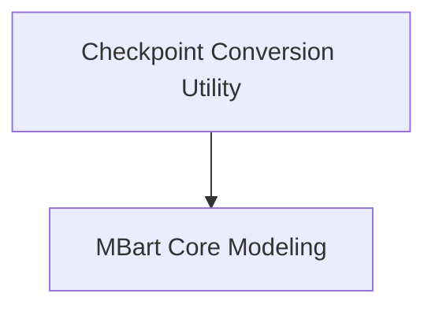

# MBart Models Documentation

## Introduction

The `mbart_models` module provides implementations and utilities for working with mBART (Multilingual Bidirectional and Auto-Regressive Transformers) models. mBART is a multilingual encoder-decoder model pre-trained on a large corpus of text in multiple languages. This module includes functionalities for converting original Fairseq checkpoints to the Hugging Face format and specialized models for downstream tasks like sequence classification and question answering.

## Architecture Overview

The `mbart_models` module is structured into key sub-modules that handle specific aspects of mBART model management and usage. The `checkpoint_conversion` sub-module is responsible for adapting pre-trained weights from other frameworks, while the `modeling` sub-module provides the core model architectures for different NLP tasks.

<!-- DIAGRAM_JSON
{
    "direction": "TD",
    "nodes": [
        {"id": "checkpoint_conversion", "label": "Checkpoint Conversion Utility", "type": "module", "link": "checkpoint_conversion.md"},
        {"id": "modeling", "label": "MBart Core Modeling", "type": "module", "link": "modeling.md"}
    ],
    "edges": [
        {"source": "checkpoint_conversion", "target": "modeling"}
    ],
    "groups": []
}
-->

## Sub-modules

### [Checkpoint Conversion Utility](checkpoint_conversion.md)
This sub-module contains the logic for converting mBART model checkpoints from their original Fairseq format to a PyTorch-compatible format suitable for use with Hugging Face Transformers.

### [MBart Core Modeling](modeling.md)
This sub-module defines the core mBART model architectures adapted for specific downstream tasks such as sequence classification and question answering.