# `mbart_wav2vec2_conversion` Module Documentation

## Introduction

The `mbart_wav2vec2_conversion` module is a crucial component within the larger `speech_encoder_decoder_models` system, specifically designed to facilitate the conversion of pre-trained Fairseq mBART-Wav2Vec2 sequence-to-sequence checkpoints into the Hugging Face Transformers format. This module ensures interoperability and allows for the seamless integration and utilization of these powerful speech models within the Hugging Face ecosystem.

## Purpose and Core Functionality

The primary purpose of this module is to provide a robust and efficient method for converting Fairseq's mBART-Wav2Vec2 models into a format compatible with the Hugging Face `SpeechEncoderDecoderModel` architecture. This conversion process involves meticulously mapping and transferring the weights from the Fairseq encoder (Wav2Vec2) and decoder (mBART) components to their corresponding Hugging Face counterparts.

The core functionality is encapsulated in the `convert_wav2vec2_checkpoint` function, which performs the following key operations:

1.  **Configuration Loading**: It loads the necessary configurations for both the Wav2Vec2 encoder (`Wav2Vec2Config`) and the mBART decoder (`MBartConfig`) from specified paths, applying any necessary overrides like adapter settings.
2.  **Model Loading**: It loads the pre-trained Fairseq model ensemble and task, extracting the main model for weight conversion.
3.  **Feature Extractor Initialization**: A `Wav2Vec2FeatureExtractor` is initialized using the encoder configuration.
4.  **Encoder Weight Conversion**: It initializes a Hugging Face `Wav2Vec2Model` and recursively loads the weights from the Fairseq encoder.
5.  **Decoder Weight Conversion**: It initializes a Hugging Face `MBartForCausalLM` and loads the state dictionary from the Fairseq decoder, with warnings for any missing or unexpected keys.
6.  **SpeechEncoderDecoderModel Assembly**: The converted encoder and decoder are combined into a `SpeechEncoderDecoderModel`.
7.  **Tokenizer Handling**: An `MBart50Tokenizer` is loaded and saved to the target directory.
8.  **Configuration Finalization**: The combined model's configuration (`SpeechEncoderDecoderConfig`) is updated with tokenizer details and special token IDs (e.g., `pad_token_id`, `bos_token_id`, `eos_token_id`, `decoder_start_token_id`).
9.  **Saving**: The final Hugging Face `SpeechEncoderDecoderModel` and `Wav2Vec2FeatureExtractor` are saved to the specified output folder.

This intricate process ensures that the converted model retains its pre-trained capabilities and can be directly used for tasks like speech-to-text or speech translation within the Hugging Face framework.

## Architecture and Component Relationships

The `mbart_wav2vec2_conversion` module primarily revolves around the `convert_wav2vec2_checkpoint` function, which orchestrates the conversion process by interacting with various configuration, model, and utility components. The diagram below illustrates these relationships.

<!-- DIAGRAM_JSON
{
    "direction": "TD",
    "nodes": [
        {"id": "convert_wav2vec2_checkpoint", "label": "convert_wav2vec2_checkpoint", "type": "component", "link": null},
        {"id": "wav2vec2_config", "label": "Wav2Vec2Config", "type": "external", "link": "wav2vec2_models.md"},
        {"id": "mbart_config", "label": "MBartConfig", "type": "external", "link": "mbart_models.md"},
        {"id": "fairseq", "label": "Fairseq Checkpoint Utils", "type": "external", "link": null},
        {"id": "wav2vec2_feature_extractor", "label": "Wav2Vec2FeatureExtractor", "type": "external", "link": "wav2vec2_models.md"},
        {"id": "wav2vec2_model", "label": "Wav2Vec2Model", "type": "external", "link": "wav2vec2_models.md"},
        {"id": "recursively_load_weights_wav2vec2", "label": "recursively_load_weights_wav2vec2", "type": "component", "link": null},
        {"id": "mbart_for_causal_lm", "label": "MBartForCausalLM", "type": "external", "link": "mbart_models.md"},
        {"id": "speech_encoder_decoder_model", "label": "SpeechEncoderDecoderModel", "type": "external", "link": "speech_encoder_decoder_models.md"},
        {"id": "mbart50_tokenizer", "label": "MBart50Tokenizer", "type": "external", "link": "mbart_models.md"},
        {"id": "speech_encoder_decoder_config", "label": "SpeechEncoderDecoderConfig", "type": "external", "link": "speech_encoder_decoder_models.md"}
    ],
    "edges": [
        {"source": "convert_wav2vec2_checkpoint", "target": "wav2vec2_config"},
        {"source": "convert_wav2vec2_checkpoint", "target": "mbart_config"},
        {"source": "convert_wav2vec2_checkpoint", "target": "fairseq"},
        {"source": "convert_wav2vec2_checkpoint", "target": "wav2vec2_feature_extractor"},
        {"source": "convert_wav2vec2_checkpoint", "target": "wav2vec2_model"},
        {"source": "convert_wav2vec2_checkpoint", "target": "recursively_load_weights_wav2vec2"},
        {"source": "convert_wav2vec2_checkpoint", "target": "mbart_for_causal_lm"},
        {"source": "convert_wav2vec2_checkpoint", "target": "speech_encoder_decoder_model"},
        {"source": "convert_wav2vec2_checkpoint", "target": "mbart50_tokenizer"},
        {"source": "convert_wav2vec2_checkpoint", "target": "speech_encoder_decoder_config"}
    ],
    "groups": []
}
-->

```mermaid
graph TD
    convert_wav2vec2_checkpoint[convert_wav2vec2_checkpoint]
    wav2vec2_config(Wav2Vec2Config)
    mbart_config(MBartConfig)
    fairseq[Fairseq Checkpoint Utils]
    wav2vec2_feature_extractor(Wav2Vec2FeatureExtractor)
    wav2vec2_model(Wav2Vec2Model)
    recursively_load_weights_wav2vec2[recursively_load_weights_wav2vec2]
    mbart_for_causal_lm(MBartForCausalLM)
    speech_encoder_decoder_model(SpeechEncoderDecoderModel)
    mbart50_tokenizer(MBart50Tokenizer)
    speech_encoder_decoder_config(SpeechEncoderDecoderConfig)

    convert_wav2vec2_checkpoint --> wav2vec2_config
    convert_wav2vec2_checkpoint --> mbart_config
    convert_wav2vec2_checkpoint --> fairseq
    convert_wav2vec2_checkpoint --> wav2vec2_feature_extractor
    convert_wav2vec2_checkpoint --> wav2vec2_model
    convert_wav2vec2_checkpoint --> recursively_load_weights_wav2vec2
    convert_wav2vec2_checkpoint --> mbart_for_causal_lm
    convert_wav2vec2_checkpoint --> speech_encoder_decoder_model
    convert_wav2vec2_checkpoint --> mbart50_tokenizer
    convert_wav2vec2_checkpoint --> speech_encoder_decoder_config

    click wav2vec2_config "wav2vec2_models.md"
    click mbart_config "mbart_models.md"
    click wav2vec2_feature_extractor "wav2vec2_models.md"
    click wav2vec2_model "wav2vec2_models.md"
    click mbart_for_causal_lm "mbart_models.md"
    click speech_encoder_decoder_model "speech_encoder_decoder_models.md"
    click mbart50_tokenizer "mbart_models.md"
    click speech_encoder_decoder_config "speech_encoder_decoder_models.md"
```

## How the Module Fits into the Overall System

This `mbart_wav2vec2_conversion` module is a specialized utility within the broader `speech_encoder_decoder_models` ecosystem. It acts as a bridge, enabling the use of models originally trained with Fairseq's mBART-Wav2Vec2 architecture within the Hugging Face Transformers library. This is crucial for leveraging pre-existing models and research in a standardized and widely adopted framework.

Its position as a sub-module of `speech_encoder_decoder_models` highlights its role in supporting the creation and deployment of speech-to-text and speech-to-speech models that combine distinct encoder (e.g., Wav2Vec2 for audio processing) and decoder (e.g., mBART for text generation) architectures. By providing the conversion logic, it contributes directly to the flexibility and extensibility of the `speech_encoder_decoder_models` module, allowing it to integrate models from various sources and formats.

This module is typically used during the initial setup phase when a Fairseq-trained model needs to be adapted for use in a Hugging Face-based application or pipeline. It ensures that the model's weights and configurations are correctly translated, making the model ready for fine-tuning, inference, or further development within the Hugging Face environment.

For more information on the individual components, refer to:
*   [wav2vec2_models](wav2vec2_models.md)
*   [mbart_models](mbart_models.md)
*   [speech_encoder_decoder_models](speech_encoder_decoder_models.md)
