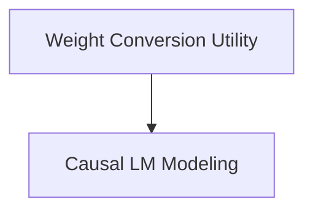

# Mistral4 Models Documentation

## Introduction

The `mistral4_models` module provides the core components for the Mistral4 causal language model, including utilities for weight conversion and the main causal language model implementation. This module facilitates the use and integration of Mistral4 models within the HuggingFace ecosystem.

## Architecture Overview

The `mistral4_models` module is composed of two primary sub-modules:

- **Weight Conversion Utility**: Manages the conversion of Mistral4 model weights to a compatible HuggingFace format.
- **Causal LM Modeling**: Implements the Mistral4ForCausalLM class, enabling causal language modeling tasks such as text generation and loss computation.

<!-- DIAGRAM_JSON
{
    "direction": "TD",
    "nodes": [
        {"id": "weight_conversion", "label": "Weight Conversion Utility", "type": "module", "link": "weight_conversion.md"},
        {"id": "causal_lm_modeling", "label": "Causal LM Modeling", "type": "module", "link": "causal_lm_modeling.md"}
    ],
    "edges": [
        {"source": "weight_conversion", "target": "causal_lm_modeling"}
    ],
    "groups": []
}
-->

## Sub-modules

### [Weight Conversion Utility](weight_conversion.md)
This sub-module is responsible for converting Mistral4 model weights into the HuggingFace format. It supports different output formats like FP8 and BF16, ensuring compatibility and flexibility for various use cases.

### [Causal LM Modeling](causal_lm_modeling.md)
This sub-module provides the core `Mistral4ForCausalLM` class, which is the main entry point for performing causal language modeling with Mistral4 models. It handles the forward pass, computes the loss, and supports text generation capabilities, making it essential for various NLP tasks.