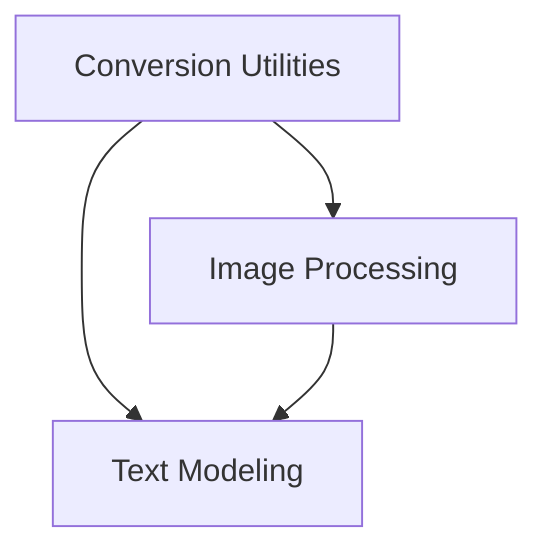

# M-LLaMA Models Documentation

## Introduction

The `mllama_models` module is responsible for implementing the M-LLaMA (Multimodal LLaMA) model architecture, encompassing functionalities for converting model weights, processing images for multimodal input, and defining the core text modeling components that interact with both text and visual information.

This module provides the foundational elements required to load, preprocess data for, and utilize M-LLaMA models within the Hugging Face ecosystem.

## Architecture Overview

The `mllama_models` module is composed of three main sub-modules, each handling a distinct aspect of the M-LLaMA model's operation:

<!-- DIAGRAM_JSON
{
    "direction": "TD",
    "nodes": [
        {"id": "conversion_utilities", "label": "Conversion Utilities", "type": "module", "link": "conversion_utilities.md"},
        {"id": "image_processing", "label": "Image Processing", "type": "module", "link": "image_processing.md"},
        {"id": "text_modeling", "label": "Text Modeling", "type": "module", "link": "text_modeling.md"}
    ],
    "edges": [
        {"source": "conversion_utilities", "target": "text_modeling"},
        {"source": "conversion_utilities", "target": "image_processing"},
        {"source": "image_processing", "target": "text_modeling"}
    ],
    "groups": []
}
-->

### Sub-modules:

- **[Conversion Utilities](conversion_utilities.md)**: This sub-module is responsible for converting M-LLaMA model weights from their original format to the Hugging Face format. It handles the serialization of the model, tokenizer, and image processor configurations and weights.

- **[Image Processing](image_processing.md)**: This sub-module focuses on the preprocessing of image inputs for the M-LLaMA model. It includes functionalities such as resizing, padding, rescaling, and normalizing images to prepare them for the multimodal text model.

- **[Text Modeling](text_modeling.md)**: This sub-module defines the core M-LLaMA text model architecture. It encompasses the embedding layer, self-attention, and cross-attention decoder layers, enabling the model to process and integrate both textual and visual information. It handles the forward pass logic for generating text outputs based on combined inputs.