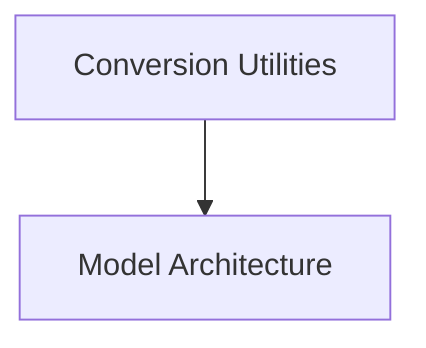

# mm_grounding_dino_models

## Introduction and Purpose

This module provides the necessary components for the MM Grounding DINO model, a powerful object detection model capable of zero-shot object detection using text prompts. It includes utilities for converting model checkpoints to the Hugging Face format and the core model architecture for performing object detection.

## Architecture Overview

The `mm_grounding_dino_models` module is structured into two main sub-modules:

- **Conversion Utilities**: Handles the conversion of original Grounding DINO model checkpoints to the Hugging Face format.
- **Model Architecture**: Defines the core `MMGroundingDinoForObjectDetection` model.

<!-- DIAGRAM_JSON
{
    "direction": "TD",
    "nodes": [
        {"id": "conversion_utilities", "label": "Conversion Utilities", "type": "module", "link": "conversion_utilities.md"},
        {"id": "model_architecture", "label": "Model Architecture", "type": "module", "link": "model_architecture.md"}
    ],
    "edges": [
        {"source": "conversion_utilities", "target": "model_architecture"}
    ],
    "groups": []
}
-->

## High-Level Functionality

### [Conversion Utilities](conversion_utilities.md)

This sub-module focuses on the `convert_mm_grounding_dino_checkpoint` function, which is responsible for loading original Grounding DINO checkpoints, converting their state dictionary to a Hugging Face compatible format, and optionally verifying outputs and pushing the model and processor to the Hugging Face Hub.

### [Model Architecture](model_architecture.md)

The `model_architecture` sub-module houses the `MMGroundingDinoForObjectDetection` class. This is the main model class for performing object detection. It encapsulates the Grounding DINO model components, including the encoder and decoder, and defines the forward pass for processing images and text inputs to produce object detection logits and bounding box predictions. It also handles the computation of the loss function during training.