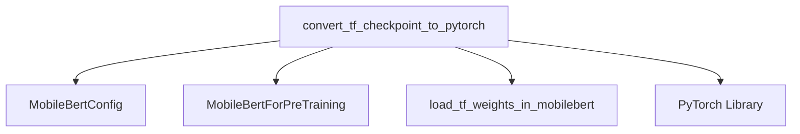

# MobileBERT Models Documentation

## Introduction

The `mobilebert_models` module is a crucial component responsible for facilitating the interoperability of MobileBERT models between TensorFlow and PyTorch frameworks. Its primary function is to convert pre-trained MobileBERT checkpoints from their original TensorFlow format into a compatible PyTorch format, enabling seamless integration and utilization within PyTorch-based applications and research.

## Architecture and Component Relationships

The core functionality of the `mobilebert_models` module revolves around the conversion utility. This utility interacts with MobileBERT-specific configuration and model architectures to ensure accurate weight mapping during the conversion process.

<!-- DIAGRAM_JSON
{
    "direction": "TD",
    "nodes": [
        {"id": "convert_tf_checkpoint_to_pytorch", "label": "convert_tf_checkpoint_to_pytorch", "type": "component", "link": null},
        {"id": "mobilebert_config", "label": "MobileBertConfig", "type": "component", "link": null},
        {"id": "mobilebert_for_pretraining", "label": "MobileBertForPreTraining", "type": "component", "link": null},
        {"id": "load_tf_weights_in_mobilebert", "label": "load_tf_weights_in_mobilebert", "type": "component", "link": null},
        {"id": "torch", "label": "PyTorch Library", "type": "external", "link": null}
    ],
    "edges": [
        {"source": "convert_tf_checkpoint_to_pytorch", "target": "mobilebert_config"},
        {"source": "convert_tf_checkpoint_to_pytorch", "target": "mobilebert_for_pretraining"},
        {"source": "convert_tf_checkpoint_to_pytorch", "target": "load_tf_weights_in_mobilebert"},
        {"source": "convert_tf_checkpoint_to_pytorch", "target": "torch"}
    ],
    "groups": []
}
-->

### Core Components

#### `convert_tf_checkpoint_to_pytorch`

-   **Purpose:** This function serves as the main entry point for converting a MobileBERT model checkpoint from TensorFlow to PyTorch. It orchestrates the loading of the TensorFlow checkpoint, the initialization of the PyTorch model, and the transfer of weights.
-   **Parameters:**
    -   `tf_checkpoint_path`: Path to the original TensorFlow MobileBERT checkpoint file.
    -   `mobilebert_config_file`: Path to the JSON configuration file for the MobileBERT model.
    -   `pytorch_dump_path`: Path where the converted PyTorch model `state_dict` will be saved.
-   **Functionality:**
    1.  Loads the MobileBERT model configuration using `MobileBertConfig.from_json_file()`.
    2.  Initializes a `MobileBertForPreTraining` PyTorch model instance with the loaded configuration.
    3.  Calls `load_tf_weights_in_mobilebert()` to transfer the weights from the TensorFlow checkpoint to the PyTorch model.
    4.  Saves the PyTorch model's `state_dict` to the specified `pytorch_dump_path`.

### How the Module Fits into the Overall System

The `mobilebert_models` module is a specialized utility within the larger model ecosystem, specifically catering to users and developers who need to migrate or utilize pre-trained MobileBERT models originating from TensorFlow in a PyTorch environment. It ensures compatibility and provides a bridge for leveraging existing TensorFlow assets within a PyTorch-centric workflow. This module is typically used during model preparation or fine-tuning pipelines where a converted PyTorch model is required.