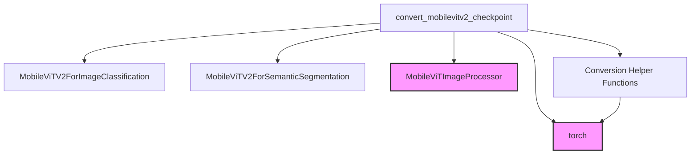

# `mobilevitv2_models` Module Documentation

The `mobilevitv2_models` module focuses on facilitating the integration of MobileViTV2 checkpoints, particularly those originating from MLCVNet, into the Hugging Face Transformers ecosystem. Its primary function is to provide utilities for converting pre-trained model weights into a format compatible with Hugging Face's `MobileViTV2ForImageClassification` and `MobileViTV2ForSemanticSegmentation` architectures. This module ensures that models trained externally can be easily loaded, utilized, and verified within the Hugging Face framework.

### Architecture and Component Relationships

The core of this module is the `convert_mobilevitv2_checkpoint` function. This function orchestrates the entire conversion process, handling the loading of original checkpoints, adapting their keys to match the Hugging Face model's `state_dict`, and verifying the outputs on sample data.

The module interacts with several key components:

*   **MobileViTV2 Models**: It dynamically loads either `MobileViTV2ForImageClassification` or `MobileViTV2ForSemanticSegmentation` based on the specified task, demonstrating its adaptability to different computer vision tasks. These model classes are assumed to be defined elsewhere within the broader `mobilevitv2` model family, providing the structural definitions for the converted weights.
*   **Image Processing**: The module utilizes `MobileViTImageProcessor` for preparing input images, ensuring that the input format for verification is consistent with the model's expectations. This component is part of the [image_utilities](image_utilities.md) module, which handles various image manipulation tasks.
*   **Conversion Utilities**: A set of helper functions (`get_mobilevitv2_config`, `remove_unused_keys`, `create_rename_keys`, `rename_key`, `prepare_img`) are employed to streamline the checkpoint adaptation process. These utilities handle configuration loading, state dictionary key normalization, and test image generation.

The conversion process involves:
1.  Loading the appropriate MobileViTV2 model configuration.
2.  Loading the original checkpoint's `state_dict`.
3.  Modifying the `state_dict` keys to align with the Hugging Face model's expected keys.
4.  Loading the modified `state_dict` into the Hugging Face model.
5.  Performing an inference pass with a sample image and verifying the output logits, especially for image classification tasks, to ensure successful conversion.
6.  Saving the converted model and its associated image processor.

### How the module fits into the overall system

The `mobilevitv2_models` module plays a crucial role in expanding the utility of pre-trained MobileViTV2 models within the Hugging Face ecosystem. By providing a robust conversion mechanism, it allows developers to leverage existing MobileViTV2 checkpoints for tasks such as image classification and semantic segmentation, without needing to retrain models from scratch. This integration enhances interoperability and accelerates research and development by making a wider array of pre-trained models accessible through a standardized framework.

<!-- DIAGRAM_JSON
{
    "direction": "TD",
    "nodes": [
        {"id": "convert_checkpoint", "label": "convert_mobilevitv2_checkpoint", "type": "component", "link": null},
        {"id": "image_classification_model", "label": "MobileViTV2ForImageClassification", "type": "component", "link": null},
        {"id": "semantic_segmentation_model", "label": "MobileViTV2ForSemanticSegmentation", "type": "component", "link": null},
        {"id": "image_processor", "label": "MobileViTImageProcessor", "type": "external", "link": "image_utilities.md"},
        {"id": "conversion_helpers", "label": "Conversion Helper Functions", "type": "component", "link": null},
        {"id": "torch_lib", "label": "torch", "type": "external", "link": null}
    ],
    "edges": [
        {"source": "convert_checkpoint", "target": "image_classification_model"},
        {"source": "convert_checkpoint", "target": "semantic_segmentation_model"},
        {"source": "convert_checkpoint", "target": "image_processor"},
        {"source": "convert_checkpoint", "target": "conversion_helpers"},
        {"source": "convert_checkpoint", "target": "torch_lib"},
        {"source": "conversion_helpers", "target": "torch_lib"}
    ],
    "groups": []
}
-->
