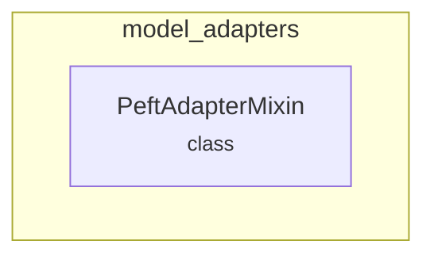

# model_adapters
The `model_adapters` module provides functionalities for integrating PEFT (Parameter-Efficient Fine-Tuning) adapters into transformer models, enabling efficient loading and management of various adapter types.

<!-- DIAGRAM_JSON
{
  "nodes": [
    {
      "id": "model_adapters",
      "label": "model_adapters",
      "type": "module"
    },
    {
      "id": "PeftAdapterMixin",
      "label": "PeftAdapterMixin",
      "type": "class"
    }
  ],
  "edges": [
    {
      "source": "model_adapters",
      "target": "PeftAdapterMixin",
      "type": "contains"
    }
  ],
  "groups": [
    {
      "id": "model_adapters_group",
      "label": "model_adapters",
      "nodes": ["PeftAdapterMixin"]
    }
  ]
}
-->
