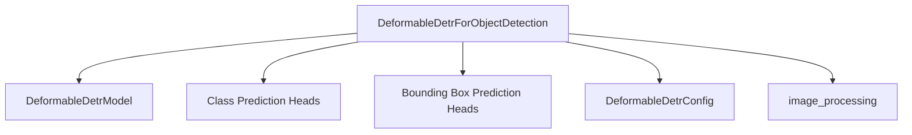

# model_architecture Module Documentation

## Introduction

The `model_architecture` module within `deformable_detr_models` provides the core implementation for object detection using the Deformable DETR (DEtection TRansformer) architecture. Its primary component, `DeformableDetrForObjectDetection`, enables end-to-end object detection, taking raw image pixel values and outputting predicted bounding boxes and class probabilities.

## Architecture and Component Relationships

### DeformableDetrForObjectDetection

`DeformableDetrForObjectDetection` is the main class responsible for orchestrating the object detection process. It builds upon the foundational `DeformableDetrModel` (which handles the encoder-decoder transformer architecture) and augments it with specialized heads for predicting object classes and bounding box coordinates.

**Core Functionality:**

*   **Initialization**: Configures the Deformable DETR model, including the number of decoder layers, the use of two-stage detection, and box refinement. It dynamically sets up class and bounding box prediction heads (`class_embed` and `bbox_embed`).
*   **Forward Pass**: Processes input `pixel_values` (images) through the `DeformableDetrModel` to obtain hidden states and reference points. It then applies the prediction heads to these outputs to generate final class logits and bounding box predictions.
*   **Loss Calculation**: If `labels` are provided, it computes the bipartite matching loss to train the model.
*   **Output**: Returns `DeformableDetrObjectDetectionOutput`, which includes loss, logits, predicted boxes, and various intermediate hidden states and attentions.

**Internal Components:**

*   `DeformableDetrModel`: The underlying encoder-decoder transformer model. This handles feature extraction and cross-attention mechanisms.
*   `class_embed` (`nn.ModuleList[nn.Linear]`): A list of linear layers, one for each decoder layer, responsible for predicting object class probabilities.
*   `bbox_embed` (`nn.ModuleList[DeformableDetrMLPPredictionHead]`): A list of Multi-Layer Perceptron (MLP) prediction heads, one for each decoder layer, responsible for predicting bounding box coordinates.

**External Dependencies:**

*   `image_processing`: This module handles the preprocessing of input images, converting them into the format required by the `DeformableDetrModel`. Specifically, `DeformableDetrImageProcessorPil` is used for this purpose.
*   `torch`: The underlying deep learning framework for tensor operations.

### Diagram

<!-- DIAGRAM_JSON
{
    "direction": "TD",
    "nodes": [
        {"id": "deformable_detr_object_detection", "label": "DeformableDetrForObjectDetection", "type": "component", "link": null},
        {"id": "deformable_detr_model", "label": "DeformableDetrModel", "type": "component", "link": null},
        {"id": "class_embed", "label": "Class Prediction Heads", "type": "component", "link": null},
        {"id": "bbox_embed", "label": "Bounding Box Prediction Heads", "type": "component", "link": null},
        {"id": "image_processing", "label": "image_processing", "type": "external", "link": "image_processing.md"},
        {"id": "deformable_detr_config", "label": "DeformableDetrConfig", "type": "component", "link": null}
    ],
    "edges": [
        {"source": "deformable_detr_object_detection", "target": "deformable_detr_model"},
        {"source": "deformable_detr_object_detection", "target": "class_embed"},
        {"source": "deformable_detr_object_detection", "target": "bbox_embed"},
        {"source": "deformable_detr_object_detection", "target": "image_processing"},
        {"source": "deformable_detr_object_detection", "target": "deformable_detr_config"}
    ],
    "groups": []
}
-->

## How it Fits into the Overall System

The `model_architecture` module, specifically `DeformableDetrForObjectDetection`, serves as the primary executable model within the larger `deformable_detr_models` ecosystem. It orchestrates the process of taking preprocessed images and generating object detection results. It depends heavily on the `DeformableDetrModel` for the core transformer logic and interacts with the `image_processing` module for input preparation. While `DeformableDetrForObjectDetection` itself doesn't perform checkpoint conversions, the overall `deformable_detr_models` also includes a `conversion_utility` to handle transformations from other formats to PyTorch, ensuring model compatibility and interoperability. This modular design allows for clear separation of concerns, where `model_architecture` focuses on the model inference and training aspects of object detection.
