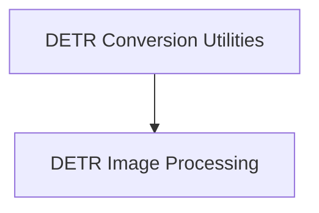

# Model Conversion Utilities

This documentation provides an overview of various `model_conversion` utilities found across different model architectures within the Hugging Face Transformers library. These modules are dedicated to facilitating the conversion of diverse model checkpoints into a format compatible with Hugging Face, ensuring seamless integration and usability.

## General Purpose and Core Functionality

The primary purpose of these `model_conversion` utilities is to provide robust methods for transforming pre-trained model weights from their original sources into the standardized Hugging Face format. This is crucial for enabling researchers and developers to leverage existing models within the `transformers` ecosystem.

The core functionalities provided by this module include:

*   **Original PyTorch Checkpoint Conversion**: Handling the specifics of converting DETR model checkpoints that originate from their initial PyTorch implementations. This ensures compatibility with models released by the original authors.
*   **Generic PyTorch Checkpoint Conversion**: Providing a more generalized approach to convert DETR checkpoints to a PyTorch format that adheres to Hugging Face's model loading conventions.

These conversion processes involve careful mapping of parameter names, architectural adjustments, and ensuring that the converted model retains its original performance characteristics.

## DETR Model Conversion - Architecture and Component Relationships

The `model_conversion` module acts as a logical grouping for the DETR-specific conversion logic. It contains the `detr_conversion_utilities` sub-module, which further organizes the distinct conversion routines.

The `model_conversion` process often interacts with image processing functionalities, which are handled by the `image_processing` module (specifically within `detr_models`). This is because DETR models operate on images, and their conversion might require specific image pre-processing or post-processing configurations to be correctly set up.

<!-- DIAGRAM_JSON
{
    "direction": "TD",
    "nodes": [
        {"id": "detr_conversion_utilities", "label": "DETR Conversion Utilities", "type": "component", "link": "detr_conversion_utilities.md"},
        {"id": "detr_image_processing", "label": "DETR Image Processing", "type": "external", "link": "image_processing.md"}
    ],
    "edges": [
        {"source": "detr_conversion_utilities", "target": "detr_image_processing"}
    ],
    "groups": []
}
-->


### DETR Core Components Details

The `model_conversion` module directly encompasses the following key conversion functions:

*   `src.transformers.models.detr.convert_detr_original_pytorch_checkpoint_to_pytorch.convert_detr_checkpoint`:
    This function is responsible for converting checkpoints from the original DETR PyTorch repository. It typically involves loading the state dictionary, remapping layer names and parameters to match the Hugging Face `DetrModel` architecture, and saving the converted weights.

*   `src.transformers.models.detr.convert_detr_to_pytorch.convert_detr_checkpoint`:
    This function provides a general utility for converting DETR checkpoints. It likely offers a more flexible approach to adapt various PyTorch-based DETR models into the Hugging Face format.

For detailed implementation specifics of these conversion routines, refer to the documentation of the [detr_conversion_utilities](detr_conversion_utilities.md) module.

### DETR Conversion's Role in the System

The `model_conversion` module is an integral part of the `detr_models` ecosystem within the `transformers` library. It acts as a crucial bridge, allowing users to import and utilize pre-trained DETR models from external sources. Without this module, developers would need to manually adapt model weights, which can be a complex and error-prone process. By standardizing the conversion, it accelerates research and development involving DETR models.

It interacts closely with the `detr_models` module itself, providing the converted models ready for tasks such as object detection and panoptic segmentation. The converted models are then instantiated using the appropriate `DetrModel` or task-specific `DetrFor*` classes. The `image_processing` module ensures that the converted models can receive inputs in the correct format.

## LW-DETR Model Conversion

The `model_conversion` module, specifically within the context of `lw_detr_models`, is responsible for converting pre-trained LightWeight DETR (LW-DETR) model checkpoints into a format compatible with the Hugging Face Transformers library. This module facilitates the integration and utilization of LW-DETR models within the broader Hugging Face ecosystem, enabling users to easily load, fine-tune, and deploy these models.

### Purpose and Core Functionality (LW-DETR)

The primary purpose of this LW-DETR `model_conversion` module is to provide a streamlined process for taking a raw LW-DETR model checkpoint and transforming it into a standardized PyTorch model that adheres to Hugging Face's architectural conventions. This involves:

*   **Checkpoint Retrieval**: Handling the retrieval of model checkpoints, either by downloading them from the Hugging Face Hub or by loading them from a local path.
*   **Argument Parsing**: Providing a command-line interface for users to specify conversion parameters such as the model name, output directory, and options for pushing the converted model to the Hugging Face Hub.
*   **Model Conversion Logic**: Orchestrating the core conversion process, which involves mapping the original model's weights and configuration to the corresponding Hugging Face LW-DETR model structure.

*   **Hub Integration**: Optionally pushing the converted model to a specified Hugging Face organization or user repository, making it publicly available for others to use.

### Architecture and Component Relationships (LW-DETR)

The `model_conversion` module (for `lw_detr_models`) primarily centers around the `main` function, which acts as the entry point for the conversion script. This function orchestrates the overall conversion flow by interacting with external libraries for argument parsing and checkpoint handling, and by invoking the dedicated conversion logic.

<!-- DIAGRAM_JSON
{
    "direction": "TD",
    "nodes": [
        {"id": "main_function", "label": "main()", "type": "component", "link": null},
        {"id": "convert_checkpoint_logic", "label": "convert_lw_detr_checkpoint()", "type": "component", "link": null},
        {"id": "huggingface_hub", "label": "Hugging Face Hub", "type": "external", "link": null},
        {"id": "argparse_module", "label": "argparse", "type": "external", "link": null},
        {"id": "lw_detr_model_architecture", "label": "lw_detr_models", "type": "external", "link": "lw_detr_models.md"}
    ],
    "edges": [
        {"source": "main_function", "target": "argparse_module", "label": "parses arguments"},
        {"source": "main_function", "target": "huggingface_hub", "label": "downloads checkpoint (optional)"},
        {"source": "main_function", "target": "convert_checkpoint_logic", "label": "invokes conversion"},
        {"source": "convert_checkpoint_logic", "target": "lw_detr_model_architecture", "label": "generates HF model"}
    ],
    "groups": []
}
-->

```mermaid
graph TD
    main_function[main()]
    convert_checkpoint_logic[convert_lw_detr_checkpoint()]
    huggingface_hub[Hugging Face Hub]:::external
    argparse_module[argparse]:::external
    lw_detr_model_architecture[lw_detr_models]:::external

    main_function -- parses arguments --> argparse_module
    main_function -- downloads checkpoint (optional) --> huggingface_hub
    main_function -- invokes conversion --> convert_checkpoint_logic
    convert_checkpoint_logic -- generates HF model --> lw_detr_model_architecture

    classDef external fill:#f9f,stroke:#333,stroke-width:2px;
```

### Core Components (LW-DETR)

#### `src.transformers.models.lw_detr.convert_lw_detr_to_hf.main`

This function serves as the command-line interface for converting LW-DETR checkpoints. It takes several arguments to control the conversion process:

*   `--model_name`: Specifies the name of the LW-DETR model to convert.
*   `--pytorch_dump_folder_path`: Defines the directory where the converted PyTorch model will be saved.
*   `--checkpoint_path`: An optional argument to specify a local path to the checkpoint file. If not provided, the script attempts to download the checkpoint from the Hugging Face Hub.
*   `--push_to_hub`: A flag to indicate whether the converted model should be pushed to the Hugging Face Hub.
*   `--organization`: The organization on the Hugging Face Hub to push the model to (defaults to "AnnaZhang").

The `main` function first parses these arguments. If a local `checkpoint_path` is not provided, it downloads the checkpoint from a predefined repository on the Hugging Face Hub using `hf_hub_download`. Finally, it calls the `convert_lw_detr_checkpoint` function (which contains the actual logic for weight mapping and model instantiation) to perform the conversion and save or push the model.

### LW-DETR Conversion's Role in the System

The `model_conversion` module for `lw_detr_models` is a crucial utility that bridges the gap between original LW-DETR model implementations and the Hugging Face Transformers ecosystem. By converting checkpoints, it allows LW-DETR models to be seamlessly integrated, enabling developers and researchers to leverage the extensive features and tools provided by Hugging Face, such as unified APIs, easy model loading, and compatibility with various downstream tasks. This module enhances the interoperability and accessibility of LW-DETR models within the broader machine learning community.