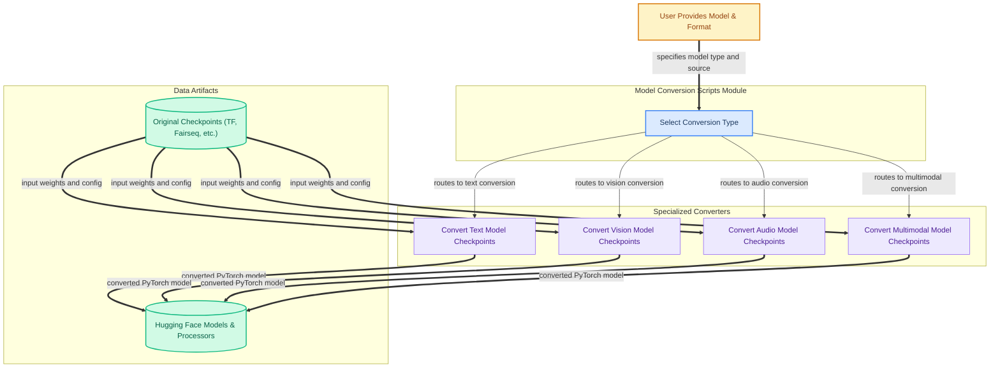

The `model_conversion_scripts` module provides a comprehensive set of utilities designed to convert pre-trained model checkpoints from various original formats (e.g., TensorFlow, Fairseq, ParlAI, Orbax, Mamba-SSM, Flax) into the Hugging Face Transformers PyTorch format. This enables users to seamlessly integrate and utilize models trained in other frameworks within the Hugging Face ecosystem, facilitating interoperability and broader access to diverse model architectures.

### How the module's components work together

The module acts as a central hub for model conversion, categorizing conversion tasks by modality. A user initiates a conversion by specifying the model type and its original format. The module then routes this request to the appropriate specialized converter:

*   **Text Model Converters:** Handle language models from various sources.
*   **Vision Model Converters:** Manage image and video models.
*   **Audio Model Converters:** Process speech and audio models.
*   **Multimodal Converters:** Deal with models that combine multiple modalities (e.g., vision and language).

Each specialized converter takes the original model checkpoints and configuration, performs the necessary weight mapping and architectural adjustments, and outputs a Hugging Face compatible PyTorch model and its associated processor/tokenizer.

### References to the core components documentation

*   [Text Model Converters](text_model_converters.md)
*   [Vision Model Converters](vision_model_converters.md)
*   [Audio Model Converters](audio_model_converters.md)
*   [Multimodal Converters](multimodal_converters.md)