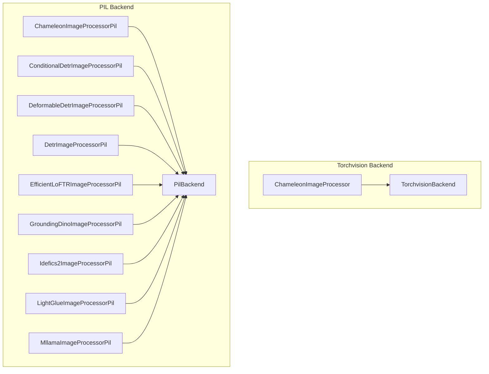

# model_specific_processors
This module provides various model-specific image processors, primarily extending `PilBackend` and `TorchvisionBackend` for specialized image manipulation and annotation preparation.

<!-- DIAGRAM_JSON
{
  "nodes": [
    {"id": "ChameleonImageProcessor", "label": "ChameleonImageProcessor"},
    {"id": "ChameleonImageProcessorPil", "label": "ChameleonImageProcessorPil"},
    {"id": "ConditionalDetrImageProcessorPil", "label": "ConditionalDetrImageProcessorPil"},
    {"id": "DeformableDetrImageProcessorPil", "label": "DeformableDetrImageProcessorPil"},
    {"id": "DetrImageProcessorPil", "label": "DetrImageProcessorPil"},
    {"id": "EfficientLoFTRImageProcessorPil", "label": "EfficientLoFTRImageProcessorPil"},
    {"id": "GroundingDinoImageProcessorPil", "label": "GroundingDinoImageProcessorPil"},
    {"id": "Idefics2ImageProcessorPil", "label": "Idefics2ImageProcessorPil"},
    {"id": "LightGlueImageProcessorPil", "label": "LightGlueImageProcessorPil"},
    {"id": "MllamaImageProcessorPil", "label": "MllamaImageProcessorPil"},
    {"id": "TorchvisionBackend", "label": "TorchvisionBackend", "class": "abstract"},
    {"id": "PilBackend", "label": "PilBackend", "class": "abstract"}
  ],
  "edges": [
    {"source": "ChameleonImageProcessor", "target": "TorchvisionBackend", "type": "inherits"},
    {"source": "ChameleonImageProcessorPil", "target": "PilBackend", "type": "inherits"},
    {"source": "ConditionalDetrImageProcessorPil", "target": "PilBackend", "type": "inherits"},
    {"source": "DeformableDetrImageProcessorPil", "target": "PilBackend", "type": "inherits"},
    {"source": "DetrImageProcessorPil", "target": "PilBackend", "type": "inherits"},
    {"source": "EfficientLoFTRImageProcessorPil", "target": "PilBackend", "type": "inherits"},
    {"source": "GroundingDinoImageProcessorPil", "target": "PilBackend", "type": "inherits"},
    {"source": "Idefics2ImageProcessorPil", "target": "PilBackend", "type": "inherits"},
    {"source": "LightGlueImageProcessorPil", "target": "PilBackend", "type": "inherits"},
    {"source": "MllamaImageProcessorPil", "target": "PilBackend", "type": "inherits"}
  ],
  "groups": [
    {"id": "TorchvisionBackendGroup", "label": "Torchvision Backend", "nodes": ["TorchvisionBackend", "ChameleonImageProcessor"]},
    {"id": "PilBackendGroup", "label": "PIL Backend", "nodes": ["PilBackend", "ChameleonImageProcessorPil", "ConditionalDetrImageProcessorPil", "DeformableDetrImageProcessorPil", "DetrImageProcessorPil", "EfficientLoFTRImageProcessorPil", "GroundingDinoImageProcessorPil", "Idefics2ImageProcessorPil", "LightGlueImageProcessorPil", "MllamaImageProcessorPil"]}
  ]
}
-->
