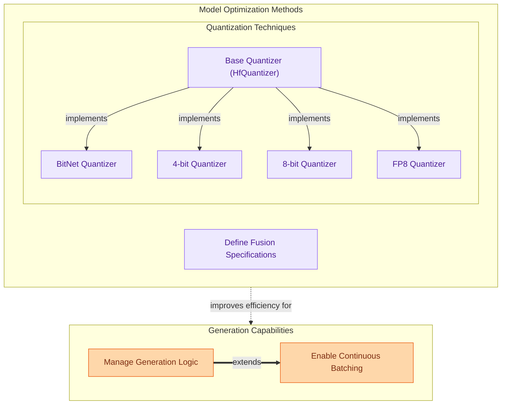

The `model_utilities` module provides essential tools and strategies for optimizing, enhancing, and efficiently deploying transformer models. It encompasses advanced text generation techniques, various quantization methods for model size and speed optimization, and fusion specifications for improving model efficiency. This module helps users fine-tune model behavior, reduce computational footprint, and accelerate inference.

### Module Structure and Interaction

The `model_utilities` module is organized into three main functional areas: `generation` for controlling model output, `quantization` for model compression, and `optimization_and_fusion` for structural efficiency improvements.

### Core Components

*   **Generation Mixins**:
    *   [`GenerationMixin`](generation.md): Provides the core logic for various auto-regressive text generation strategies, including greedy, sampling, beam search, and assisted decoding.
    *   [`ContinuousMixin`](generation.md): Manages continuous batching for inference, optimizing throughput by handling requests asynchronously and dynamically.

*   **Quantization Strategies**:
    *   [`HfQuantizer`](quantization.md): A conceptual base for various quantization methods.
    *   [`BitNetHfQuantizer`](quantization.md): Implements BitNet quantization for model optimization.
    *   [`Bnb4BitHfQuantizer`](quantization.md): Provides 4-bit quantization using BitsAndBytes.
    *   [`Bnb8BitHfQuantizer`](quantization.md): Provides 8-bit quantization using BitsAndBytes.
    *   [`FineGrainedFP8HfQuantizer`](quantization.md): Offers fine-grained FP8 quantization for specific hardware.

*   **Optimization and Fusion**:
    *   [`PatchEmbeddingsFusionSpec`](optimization_and_fusion.md): Defines specifications for fusing `Conv3d` patch embeddings into `Linear` projections to enhance model efficiency.