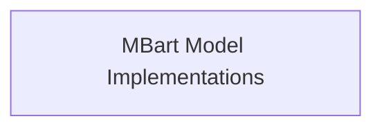

# Modeling Module
# Modeling Module Documentation

## Introduction
This module serves as the central hub for various model implementations within the system, focusing on specific model architectures and their applications. It encompasses a wide range of tasks, from natural language processing to computer vision, providing a structured approach to integrating and managing diverse neural network models.

## Architecture Overview
The `modeling` module is designed to be highly modular, allowing for easy integration of new model architectures and their specialized functionalities. It organizes model implementations into distinct sub-modules, each focusing on a specific model or a family of related models. This structure promotes code reusability, maintainability, and clear separation of concerns.

<!-- DIAGRAM_JSON
{
    "direction": "TD",
    "nodes": [
        {"id": "mbart_model_implementations", "label": "MBart Model Implementations", "type": "module", "link": "mbart_model_implementations.md"}
    ],
    "edges": []
}
-->

## Sub-modules

### MBart Model Implementations
The `mbart_model_implementations` sub-module provides the core implementations for the MBart model, specifically tailored for sequence classification and question answering tasks. It encapsulates the logic and components required to perform these tasks efficiently using the MBart architecture.

For more detailed information, refer to the [MBart Model Implementations](mbart_model_implementations.md) documentation.
# Modeling Module

The `modeling` module serves as a central hub for various model implementations and their core functionalities within the system. It encompasses a wide range of models, from question answering and causal language models to advanced speech-to-speech and text-to-text translation systems. This module provides a unified interface for interacting with diverse neural network architectures, facilitating their integration and deployment.

## Architecture Overview

The `modeling` module is structured to provide clear separation of concerns, with distinct sub-modules dedicated to specific model architectures or tasks. The following diagram illustrates the relationships and dependencies between these components:

<!-- DIAGRAM_JSON
{
    "direction": "TD",
    "nodes": [
        {"id": "bart_modeling_qa", "label": "BART Question Answering", "type": "module", "link": "bart_modeling_qa.md"},
        {"id": "bart_modeling_causallm", "label": "BART Causal Language Modeling", "type": "module", "link": "bart_modeling_causallm.md"},
        {"id": "gemma4_causal_lm", "label": "Gemma4 Causal Language Model", "type": "module", "link": "gemma4_causal_lm.md"},
        {"id": "gemma4_text_model", "label": "Gemma4 Text Model", "type": "module", "link": "gemma4_text_model.md"},
        {"id": "seamless_m4t_speech_to_speech", "label": "SeamlessM4T Speech-to-Speech", "type": "module", "link": "seamless_m4t_speech_to_speech.md"},
        {"id": "seamless_m4t_speech_to_text", "label": "SeamlessM4T Speech-to-Text", "type": "module", "link": "seamless_m4t_speech_to_text.md"},
        {"id": "seamless_m4t_text_to_speech", "label": "SeamlessM4T Text-to-Speech", "type": "module", "link": "seamless_m4t_text_to_speech.md"},
        {"id": "seamless_m4t_text_to_text", "label": "SeamlessM4T Text-to-Text", "type": "module", "link": "seamless_m4t_text_to_text.md"},
        {"id": "seamless_m4t_v2_speech_to_speech", "label": "SeamlessM4Tv2 Speech-to-Speech", "type": "module", "link": "seamless_m4t_v2_speech_to_speech.md"},
        {"id": "seamless_m4t_v2_speech_to_text", "label": "SeamlessM4Tv2 Speech-to-Text", "type": "module", "link": "seamless_m4t_v2_speech_to_text.md"},
        {"id": "seamless_m4t_v2_text_to_speech", "label": "SeamlessM4Tv2 Text-to-Speech", "type": "module", "link": "seamless_m4t_v2_text_to_speech.md"},
        {"id": "seamless_m4t_v2_text_to_text", "label": "SeamlessM4Tv2 Text-to-Text", "type": "module", "link": "seamless_m4t_v2_text_to_text.md"}
    ],
    "edges": [
        {"source": "bart_modeling_qa", "target": "bart_modeling_causallm"},
        {"source": "gemma4_causal_lm", "target": "gemma4_text_model"},
        {"source": "seamless_m4t_speech_to_speech", "target": "seamless_m4t_speech_to_text"},
        {"source": "seamless_m4t_speech_to_text", "target": "seamless_m4t_text_to_speech"},
        {"source": "seamless_m4t_text_to_speech", "target": "seamless_m4t_text_to_text"},
        {"source": "seamless_m4t_v2_speech_to_speech", "target": "seamless_m4t_v2_speech_to_text"},
        {"source": "seamless_m4t_v2_speech_to_text", "target": "seamless_m4t_v2_text_to_speech"},
        {"source": "seamless_m4t_v2_text_to_speech", "target": "seamless_m4t_v2_text_to_text"}
    ],
    "groups": []
}
-->

```mermaid
graph TD
    bart_modeling_qa[BART Question Answering]
    bart_modeling_causallm[BART Causal Language Modeling]
    gemma4_causal_lm[Gemma4 Causal Language Model]
    gemma4_text_model[Gemma4 Text Model]
    seamless_m4t_speech_to_speech[SeamlessM4T Speech-to-Speech]
    seamless_m4t_speech_to_text[SeamlessM4T Speech-to-Text]
    seamless_m4t_text_to_speech[SeamlessM4T Text-to-Speech]
    seamless_m4t_text_to_text[SeamlessM4T Text-to-Text]
    seamless_m4t_v2_speech_to_speech[SeamlessM4Tv2 Speech-to-Speech]
    seamless_m4t_v2_speech_to_text[SeamlessM4Tv2 Speech-to-Text]
    seamless_m4t_v2_text_to_speech[SeamlessM4Tv2 Text-to-Speech]
    seamless_m4t_v2_text_to_text[SeamlessM4Tv2 Text-to-Text]

    bart_modeling_qa --> bart_modeling_causallm
    gemma4_causal_lm --> gemma4_text_model
    seamless_m4t_speech_to_speech --> seamless_m4t_speech_to_text
    seamless_m4t_speech_to_text --> seamless_m4t_text_to_speech
    seamless_m4t_text_to_speech --> seamless_m4t_text_to_text
    seamless_m4t_v2_speech_to_speech --> seamless_m4t_v2_speech_to_text
    seamless_m4t_v2_speech_to_text --> seamless_m4t_v2_text_to_speech
    seamless_m4t_v2_text_to_speech --> seamless_m4t_v2_text_to_text

    click bart_modeling_qa "bart_modeling_qa.md" "View BART Question Answering Documentation"
    click bart_modeling_causallm "bart_modeling_causallm.md" "View BART Causal Language Modeling Documentation"
    click gemma4_causal_lm "gemma4_causal_lm.md" "View Gemma4 Causal Language Model Documentation"
    click gemma4_text_model "gemma4_text_model.md" "View Gemma4 Text Model Documentation"
    click seamless_m4t_speech_to_speech "seamless_m4t_speech_to_speech.md" "View SeamlessM4T Speech-to-Speech Documentation"
    click seamless_m4t_speech_to_text "seamless_m4t_speech_to_text.md" "View SeamlessM4T Speech-to-Text Documentation"
    click seamless_m4t_text_to_speech "seamless_m4t_text_to_speech.md" "View SeamlessM4T Text-to-Speech Documentation"
    click seamless_m4t_text_to_text "seamless_m4t_text_to_text.md" "View SeamlessM4T Text-to-Text Documentation"
    click seamless_m4t_v2_speech_to_speech "seamless_m4t_v2_speech_to_speech.md" "View SeamlessM4Tv2 Speech-to-Speech Documentation"
    click seamless_m4t_v2_speech_to_text "seamless_m4t_v2_speech_to_text.md" "View SeamlessM4Tv2 Speech-to-Text Documentation"
    click seamless_m4t_v2_text_to_speech "seamless_m4t_v2_text_to_speech.md" "View SeamlessM4Tv2 Text-to-Speech Documentation"
    click seamless_m4t_v2_text_to_text "seamless_m4t_v2_text_to_text.md" "View SeamlessM4Tv2 Text-to-Text Documentation"
```

## Sub-module Functionality

- ### [BART Question Answering](bart_modeling_qa.md)
  This sub-module implements the BART model specifically for question answering tasks, enabling the model to identify the start and end positions of answers within a given text.

- ### [BART Causal Language Modeling](bart_modeling_causallm.md)
  Focuses on the BART model for causal language modeling, where the model generates text sequences based on preceding tokens.

- ### [Gemma4 Causal Language Model](gemma4_causal_lm.md)
  Contains the implementation of the Gemma4 model tailored for causal language modeling tasks.

- ### [Gemma4 Text Model](gemma4_text_model.md)
  Represents the core text processing component within the Gemma4 architecture.

- ### [SeamlessM4T Speech-to-Speech](seamless_m4t_speech_to_speech.md)
  Handles direct speech-to-speech translation, allowing conversion of spoken input in one language to spoken output in another.

- ### [SeamlessM4T Speech-to-Text](seamless_m4t_speech_to_text.md)
  Provides robust speech-to-text transcription, converting spoken language into written text.

- ### [SeamlessM4T Text-to-Speech](seamless_m4t_text_to_speech.md)
  Enables the synthesis of speech from text, supporting various voices and styles.

- ### [SeamlessM4T Text-to-Text](seamless_m4t_text_to_text.md)
  Facilitates text-based generation and translation tasks, operating directly on textual inputs and outputs.

- ### [SeamlessM4Tv2 Speech-to-Speech](seamless_m4t_v2_speech_to_speech.md)
  Implements advanced speech-to-speech translation functionalities using the SeamlessM4Tv2 model.

- ### [SeamlessM4Tv2 Speech-to-Text](seamless_m4t_v2_speech_to_text.md)
  Offers enhanced speech-to-text transcription capabilities with the SeamlessM4Tv2 model.

- ### [SeamlessM4Tv2 Text-to-Speech](seamless_m4t_v2_text_to_speech.md)
  Provides high-quality text-to-speech synthesis utilizing the SeamlessM4Tv2 model.

- ### [SeamlessM4Tv2 Text-to-Text](seamless_m4t_v2_text_to_text.md)
  Supports advanced text-to-text generation and translation tasks through the SeamlessM4Tv2 model.

The `modeling` module within the `bigbird_pegasus_models` package provides the core model implementations for various natural language processing tasks, specifically leveraging the BigBird Pegasus architecture. This module is essential for defining the computational graphs and forward passes for tasks such as sequence classification and question answering.

## Architecture Overview

The `modeling` module organizes its functionalities into sub-modules, primarily focusing on the specific model implementations. The core BigBird Pegasus models for sequence classification and question answering are encapsulated within a dedicated sub-module.

<!-- DIAGRAM_JSON
{
    "direction": "TD",
    "nodes": [
        {"id": "bigbird_pegasus_modeling", "label": "BigBird Pegasus Modeling", "type": "module", "link": "bigbird_pegasus_modeling.md"}
    ],
    "edges": []
}
-->

## Sub-modules

### BigBird Pegasus Modeling
This sub-module ([bigbird_pegasus_modeling.md](bigbird_pegasus_modeling.md)) provides the core modeling classes for sequence classification and question answering tasks using the BigBird Pegasus architecture. It includes `BigBirdPegasusForSequenceClassification` and `BigBirdPegasusForQuestionAnswering` which extend the base `BigBirdPegasusPreTrainedModel` to handle specific task requirements and loss calculations.