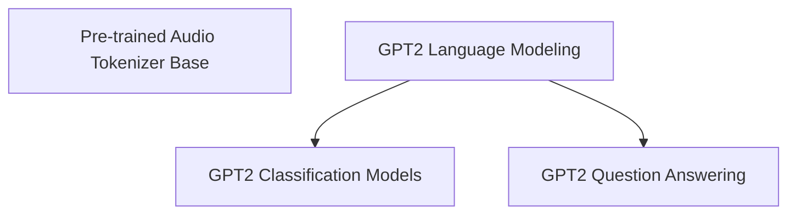

# Modeling Components

The `modeling_components` module provides a collection of foundational and specialized models, primarily focusing on GPT-2 architectures adapted for various natural language processing tasks, alongside utilities for audio tokenization. This module aims to offer versatile building blocks for developing and deploying transformer-based models.

## Architecture Overview

This module is structured into several sub-modules, each encapsulating specific functionalities related to model architectures and utilities. The diagram below illustrates the relationships and dependencies between these components.

<!-- DIAGRAM_JSON
{
    "direction": "TD",
    "nodes": [
        {"id": "audio_tokenization_base", "label": "Pre-trained Audio Tokenizer Base", "type": "module", "link": "audio_tokenization_base.md"},
        {"id": "gpt2_language_modeling", "label": "GPT2 Language Modeling", "type": "module", "link": "gpt2_language_modeling.md"},
        {"id": "gpt2_classification_models", "label": "GPT2 Classification Models", "type": "module", "link": "gpt2_classification_models.md"},
        {"id": "gpt2_question_answering_model", "label": "GPT2 Question Answering", "type": "module", "link": "gpt2_question_answering_model.md"}
    ],
    "edges": [
        {"source": "gpt2_language_modeling", "target": "gpt2_classification_models"},
        {"source": "gpt2_language_modeling", "target": "gpt2_question_answering_model"}
    ],
    "groups": []
}
-->

## Sub-modules

### [Pre-trained Audio Tokenizer Base](audio_tokenization_base.md)
This sub-module defines the base class for pre-trained audio tokenizers, providing common functionalities for audio processing. It serves as a fundamental component for any audio-related modeling within the library.

### [GPT2 Language Modeling](gpt2_language_modeling.md)
This sub-module provides core GPT2 models for language modeling tasks, including causal language modeling and double-head models for combined language modeling and multiple-choice classification. It encompasses `GPT2LMHeadModel` and `GPT2DoubleHeadsModel` to cater to various text generation and understanding needs.

### [GPT2 Classification Models](gpt2_classification_models.md)
This sub-module implements GPT2 models adapted for sequence and token classification tasks. It includes `GPT2ForSequenceClassification` and `GPT2ForTokenClassification`, enabling the application of GPT-2 architecture to categorize sequences or individual tokens.

### [GPT2 Question Answering](gpt2_question_answering_model.md)
This sub-module offers a GPT2 model specifically designed for question answering tasks. The `GPT2ForQuestionAnswering` component facilitates extractive question answering by predicting start and end positions within a given text.